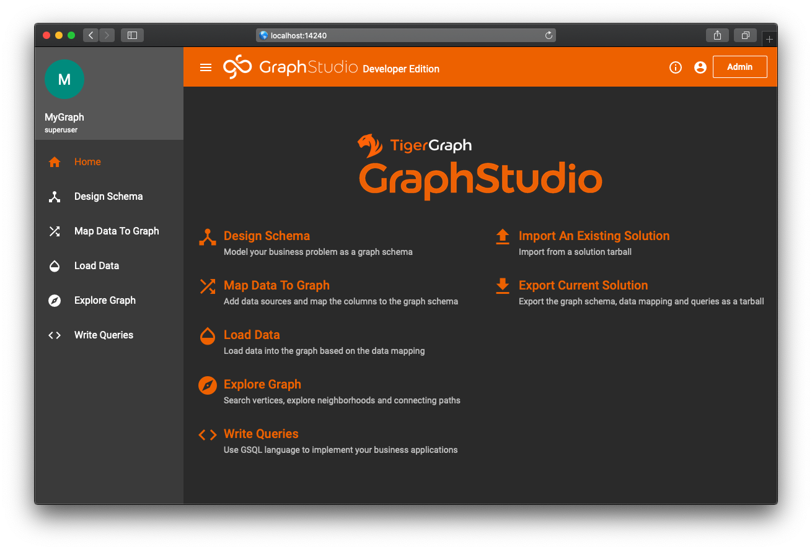

# 使用数据库的几种方式

## 通过 GSQL 客户端

在安装了 TigerGraph 的机器上，以 `tigergraph` 身份登陆，可以直接在终端中使用 GSQL 客户端

```bash
$ su - tigergraph
$ gsql
Welcome to TigerGraph Developer Edition, free for non-production, research, or educational use.
GSQL-Dev >
```

如果希望远程联接到数据库，则需要将 GSQL 客户端从安装目录中复制出来，GSQL 客户端存在于以下目录:

`/home/tigergraph/tigergraph/dev/gdk/gsql/lib/gsql_client.jar`

如果是通过 Docker 运行的，可以用 `docker cp` 将其复制出来:

```bash
$ docker cp tigergraph:/home/tigergraph/tigergraph/dev/gdk/gsql/lib/gsql_client.jar .
```

`gsql_client.jar` 是用 JAVA 写的，确保要使用 GSQL 客户端的机器上正确安装了 JAVA。通过如下命令使用 GSQL `tigergraph_server_ip` 部分替换成安装了 TigerGraph 的服务器的 IP:

```bash
$ java -jar ~/gsql_client.jar -ip tigergraph_server_ip
```

为了方便，可以给上述命令添加一个别名，并添加到 `.bashrc` 中，之后即可以直接使用 `gsql` 命令启动客户端:

```bash
$ alias gsql='java -jar ~/gsql_client.jar -ip tigergraph_server_ip'
```

### 1. 通过交互式命令行使用 gsql

```bash
$ gsql
Welcome to TigerGraph Developer Edition, free for non-production, research, or educational use.
GSQL-Dev > SHOW GRAPH *
```

### 2. 将命令作为参数传入 gsql

```bash
$ gsql "SHOW GRAPH *"
```

### 3. 调用预先编写到 gsql 脚本


```sql
SHOW GRAPH *
```


```bash
$ gsql hello.gsql
```

## 通过 Graph Studio 网页客户端

打开浏览器，访问 [http://tigergraph\_server\_ip:14240](http://tigergraph_server_ip:14240) 即可打开 Graph Studio。在 Graph Studio 中可以完成大多数比较简单图创建，数据导入等操作，复杂的数据导入则更适合通过写 `.gsql` 脚本的方式实现。除此之外，Graph Studio 上可以编写查询语句，并附带了一个非常棒的图可视化工具，可以进行非常方便的交互式分析。



## 通过 RESTful API

通过访问 9000 端口，可以使用 TigerGraph 的 RESTful API

```bash
$ curl -X GET "http://tigergraph_server_ip:9000/echo"
{
    "error": false, 
    "message": "Hello GSQL"
}
```

RESTful API 的功能包括，它可以完成包括数据查询、Schema 创建、数据导入、调用预编写的查询语句等大多数功能。

