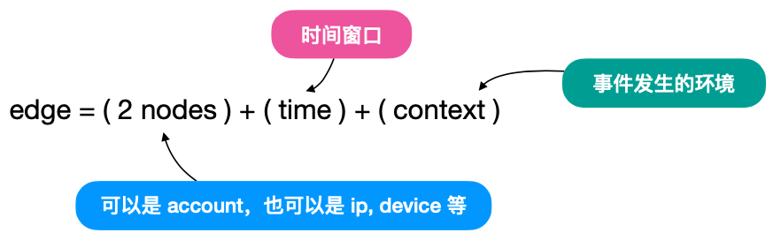
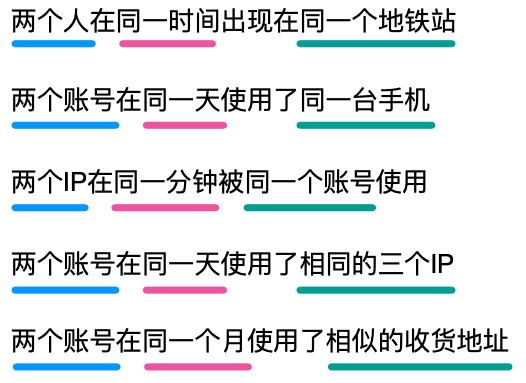
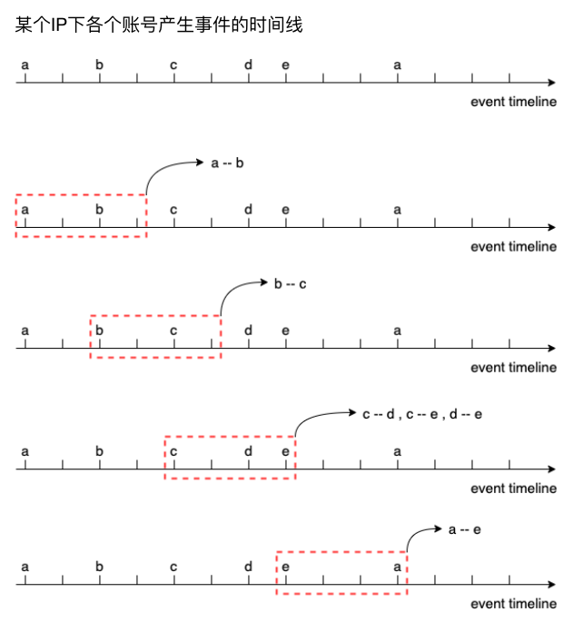
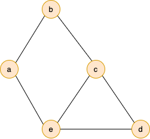
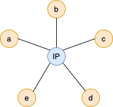
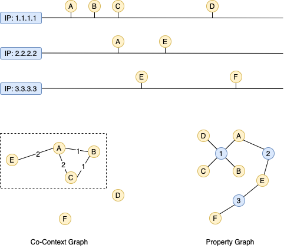
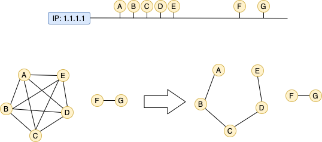
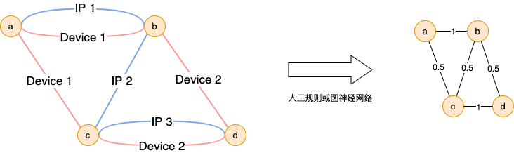

# 背景介绍

### 前言

通过前面到几个案例，我们基本上熟悉了 TigerGraph 的 Web 界面，GraphStudio 的基本使用，以及 GSQL 查询语句的写法。在我们所面临的实际问题中，应该更多去思考，如何针对不同的场景，去设计适合场景的图模型。

这一次我们使用的数据，来源于原始风控日志。什么是风控日志呢？一个线上电商系统，在一些关键业务流程上，会接入风控系统，用来判断当前用户所做的操作，是否具备较高风险。风控日志则是风控系统接收响应风控请求的日志，风控日志中每一条数据，即一个风控请求，也可以理解成用户产生了一条风控事件。

一个风控事件至少包含以下几个要素:

* 用户名
* 时间
* 事件类型
* 事件发生的环境 \( Context，或称上下文\)，例如 IP，设备号，地理位置
* 其他补充信息

常见的事件类型有，注册、登入、打卡签到、下单、支付等。根据风控系统的覆盖范围，一些营销活动也会接入风控系统，比如前面所提到的**邀请注册**，此时，邀请人和被邀请人就会计入到该事件的补充信息当中。

```javascript
{"account": "u1", "time": "2020-03-01 09:00:01", "event_type": "login", "ip": "1.1.1.1"}
{"account": "u1", "time": "2020-03-01 09:00:30", "event_type": "order", "ip": "1.1.1.1"}
{"account": "u1", "time": "2020-03-01 09:00:35", "event_type": "pay", "ip": "1.1.1.1"}
{"account": "u2", "time": "2020-03-01 09:00:01", "event_type": "login", "ip": "2.2.2.2"}
{"account": "u2", "time": "2020-03-01 09:00:02", "event_type": "login", "ip": "2.2.2.2"}
{"account": "u2", "time": "2020-03-01 09:00:03", "event_type": "login", "ip": "2.2.2.2"}
{"account": "u2", "time": "2020-03-01 09:00:04", "event_type": "login", "ip": "2.2.2.2"}
```

风控系统接收到业务系统的一条风控事件后，会返回给业务系统对当前风控事件的风险判断，通常是一个风险分值，业务系统结合该风险分值，决定是否对用户当前的操作进行拦截。拦截的方式可能是，拒绝操作，弹滑动验证码，弹短信验证码等。

一般来说，风控系统的识别引擎，由 **统计规则 + 机器学习模型** 构成。譬如同一个账户在1分钟内登录超过一定次数，那么他可能在暴力破解密码，一个 IP 地址一天下了大量订单，那他可能是一个代购。机器学习模型可能使用人工标注或者外部购买的名单，基于人工抽取的特征，进行模型训练，本质上相当于一系列复杂规则的组合。

本案例依然从团伙检测角度出发，对比之前的案例，会介绍另外一种建边的思路，并提供一些实现实时数据导入，实时团伙检测的方法。

### Co-Context Edge 共现关系边

之前案例中我们提到通过在**邀请关系**子图上寻找 Connected Component 的方式来定位黑产团伙。这是因为邀请关系是一种明确的，强力的关系。但在原始风控事件中，可以提炼的关系还有很多，比如 IP 地址，设备信息等。


一种思路如上图，可以将同一条日志中的账号，设备，IP关联到一起。但这种设计会有几个明显的问题：

1. 很难处理动态 IP 的情况。一个 IP 地址可能上午被一个黑产团伙使用，下午又被分配给了一个正常用户，带来的后果是，某些 IP 地址，尤其是 3G/4G 上网的地址，**会逐渐形成一个超大的 CC**，这里面要把正常用户与黑产账号区分开，比较困难
2. 在同一个 IP 地址下的不同用户之间的**关系强弱不容易衡量**
3. 写 GSQL 进行节点遍历的时候，比较繁琐，**影响查询效率**

另一个思路是，我们让图中只保留一种类型的节点，比如**账号**，将他们同时出现 \( **共现** \) 过的上下文信息，体现在边上。


这种构图思路，有以下几点好处:

1. 账户与账户之间直接连接，**容易定义关系强弱**，比如使用 2 个账户在同一个 IP 下出现的时间间隔，来定义他们之间的亲密程度
2. 账户与账户之间如果存在多重关系，**方便进行融合**
3. 写 GSQL 进行节点遍历，比较方便，**效率也较高**

### Co-Context  边的扩展

想象一下这么一个场景，有一个 IP 地址，今天上午 9:00 用户 `u1` 使用过，今天下午 15:01 用户 `u2` `u3` `u4` 在同一分钟内使用过，那么 `u2` 与 `u3` `u4` 的关系肯定要比 `u2` 与 `u1` 的关系来的紧密。

因此，针对这种亲密程度和时间相关的边，我们不妨为其添加一个时间上的约束。即，在一个**时间窗口**内，**出现在相同上下文的两个实体之间**，建立一条边。可以将这种边称之为:

> **Time Windowed Co-Context Edge 带时间窗口的共现关系边**
>
> 任意两个节点，如果在一个时间窗口中，使用过相同的上下文，那么他们之间有一条边



这是一种比较一般化的建边策略，对业务场景对假设较小。对比前面一个案例中的邀请关系，邀请关系是一种**显性关联 \( explicit relationship \)**，共上下文关系则是一种**隐性关联 \( implicit relationship \)**。

根据实际业务情况，我们可以很容易将共现关系边进行拓展。例如:



当 context 较严格的时候，我们可以放松 time window ，当  context 较宽松当时候，我们可以收紧 time window。比如 IP 地址是一个较宽松的 context，因为只要断线重连，通常会被分配一个新的 IP，此时时间窗口就要定小一些，比如 1 分钟。device id 是一个比较稳定的 context，因为正常用户不大可能在短期用同一台手机切换多个账号，此时时间窗口可以定大一些，比如 1 天。

### 从风控事件到 Co-Context Graph

以某 1 个 IP 地址作为 context 为例，通过滑动时间窗口的方式，为同一时间窗口内的账号，两两之间构建边



由上一步抽取的边，可以构建出 Co-Context Graph



这里顺带对比一下以前的做法，即图中包含 Account - IP 关系的方法，我们称之为 Property Graph



可以发现，在 Co-Context Graph 中，节点之间的关系是很容易判断的，a 与 b 的关系，要比 a 与 d 的关系要紧密，在之前的 Property Graph 之中，则无法区别这样的关系强弱。

将不同 IP 地址下的账户关联起来，构建出完整的图



在 Co-Context Graph 中，点与点之间与**时间差**作为距离。在上面的例子中，因为 D、F 与之前使用相同 IP 的账号，时间间隔过大，他们不会与前面的账号形成关系。这样可以避免形成超大的 Connected Component，可以很大程度降低误报率。

### Co-Context Graph 在工程中的简化

前面提到了，Co-Context 的建边条件是，任意两个节点，在同一个时间窗口内出现在同一上下文中，则他们之间有一条边。这相当于在同一个上下文的同一个时间窗口内的所有节点，两两之间建立一条边。在实际工程化的时候，会给存储、计算带来不小的压力，这里我们可以将完整的 Co-Context Graph 做一定程度的简化:



即在同一个时间窗口内的账户，不再两两之间建边，而是相邻账号之间建边。虽然 Graph 受到了很大程度的简化，但其实必要的**距离信息**依然被保留了下来。

### Co-Context Graph 中边的融合

前面以 IP 作为 context 为例，介绍了 Co-Context Graph 的生成方法。实际上可以用来生成 Co-Context Graph 的 context 选择有很多，具体可以根据不同业务需求去定制。所以从广义上讲，Co-Context Graph 中边的关系不一定只有一种，不过在图中，账号与账号之间是直接连接的，因此可以很方便的将账号之间的多重关系做进一步融合



关于多重边的融合问题，因为它的训练不发生在图数据库中，因此这里不做过多介绍，感兴趣的朋友可以去搜索一下关于图神经网络相关的材料。

本次案例只考虑 context 为 IP 地址的情况。

