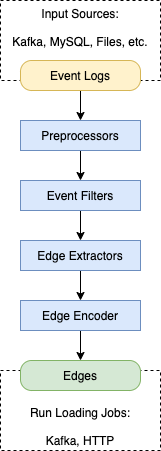

# ETL Pipeline



本次案例涉及到的 Co-Context 关系，是一种隐性关联 \( implicit relationship \)，一条边的产生涉及到多条原始日志，因此我会比较详细的讲一下 ETL 流程，即，从原始日志到图数据库当中的数据流动过程。

### 数据源

风控系统产生的事件日志，一般会先存放在如 Kafka 这样的消息队列当中，随后可能存放到 ES 中供日志搜索之用，最后再归档到数据库中。根据不同场景对数据时效性的不同要求，大致可以分为**实时场景**和**离线场景**。

针对实时场景，我们直接从 Kafka 队列中消费最新的日志数据。针对离线场景，则以定时任务的方式，每隔一段时间批量获取过去一个时段的数据。

### 数据前处理

日志中每一条记录代表一个事件，记录了事件发生时的具体信息。在进行后续操作之前，有些字段可能需要进行一些前处理。譬如时间字段的格式统一，IP字段需要去除代理IP地址等。

### 事件过滤

注意到这个案例中，我们的目标是团伙识别，即我们希望找到**账户与账户之间**的关联关系，通过他们短时间内共用过的 IP。但原始日志中并不是所有类型的事件都适合用来构建关系。

譬如说，当用户尝试登入系统的时候，会产生一条**登入事件**，当一个 IP 地址短时间产生多个**针对同一账号**的登入事件时，该 IP 可能在尝试暴力破解，当一个 IP 地址短时间产生多个**针对不同账号**的登入事件时，他可能在进行撞库攻击。

登入事件不适合作为**羊毛党识别**的数据源，因为无法得知产生该事件的人，是否为当前账号的控制人。当某个 IP 地址在进行撞库攻击时，会在短时间内尝试大量的用户名和密码，但这些用户名实际上和攻击者并没有关系，所以并不能将这些账户给关联起来。

签到事件、订单付款事件等，则适合用来建立关联，因为他们都是在用户处于登入的状态下发生的。


一个事件能否用来建立关联，关键在于，能否确保产生该事件的行为人，为当前账号的控制人。


### 关系抽取器

构成一条边的最基本要素是 `( 起点，终点，边类型 )` ，除此之外，可能会再存一些边的额外属性。比如对于 Co-Context Edge，需要再保存边的创建时间，两个账号出现的时间差信息。

因此，输出的 Edge，统一包含以下几个字段:

* src\_node : STRING，起点节点 id
* tgt\_node : STRING，终点节点 id
* edge\_type: STRING，边类型
* edge\_attrs: DICT，边属性

假设有如下原始日志:

```javascript
{"account": "u1", "time": 1583024401, "event_type": "checkin", "ip": "1.1.1.1"}
{"account": "u2", "time": 1583024431, "event_type": "checkin", "ip": "1.1.1.1"}
{"account": "u3", "time": 1583024435, "event_type": "checkin", "ip": "1.1.1.1"}
{"account": "u4", "time": 1583035201, "event_type": "checkin", "ip": "1.1.1.1"}
{"account": "u5", "time": 1583035241, "event_type": "checkin", "ip": "1.1.1.1"}
```

如果以60秒为时间窗口大小，构建 `co_ip` 边，则应该产出如下边数据:

```javascript
{"src_node": "u1", "tgt_node": "u2", "edge_type": "co_ip", "edge_attrs": {"create_time": 1583024431, "time_diff": 30}}
{"src_node": "u2", "tgt_node": "u3", "edge_type": "co_ip", "edge_attrs": {"create_time": 1583024435, "time_diff": 4}}
{"src_node": "u4", "tgt_node": "u5", "edge_type": "co_ip", "edge_attrs": {"create_time": 1583035241, "time_diff": 40}}
```

以下给了一个具体的 Python 实现方法，这是一种处理流式数据的方法:


```python
class EdgeExtractor:
    def __init__(self, edge_type):
        self.edge_type = edge_type

    def make_edge(self, src_node, tgt_node, edge_attrs):
        return {
            'src_node': src_node,
            'tgt_node': tgt_node,
            'edge_type': self.edge_type,
            'edge_attrs': edge_attrs
        }

class TimeWindowedCoContextEdgeExtractor(EdgeExtractor):
    def __init__(self, edge_type, node_field, context_field, timestamp_field, window_size):
        super().__init__(edge_type)
        self.node_field = node_field
        self.context_field = context_field
        self.timestamp_field = timestamp_field
        self.window_size = window_size
        self.context_status = dict()

    def sort_nodes(self, *nodes):
        return sorted(nodes)

    def extract(self, record):
        cur_node, context, cur_ts = (
            record[self.node_field],
            record[self.context_field],
            record[self.timestamp_field]
        )
        prev_node, prev_ts = self.context_status.get(context, (None, -inf))
        edge = None
        if prev_node is None or prev_node == cur_node:
            pass
        else:
            time_diff = cur_ts - prev_ts
            if time_diff < self.window_size:
                src_node, tgt_node = self.sort_nodes(prev_node, cur_node)
                edge_attrs = {
                    'context': context,
                    'create_time': cur_ts,
                    'time_diff': time_diff
                }
                edge = self.make_edge(src_node, tgt_node, edge_attrs)
        self.context_status[context] = (cur_node, cur_ts)
        return edge
```


将前处理并过滤好的事件，输入边抽取器，即可产出我们要的边:

```python
# ...

edge_extractor = TimeWindowedCoContextEdgeExtractor(
    edge_type="co_ip",
    node_field="account",
    context_field="ip",
    timestamp_field="time",
    window_size=60
)

for event in events:
    event = preprocess(event)
    if event_filter(event) == False:
        continue
    edge = edge_extractor.extract(event)
    # ...
# ...
```

### Edge Encoder

因为 TigerGraph 支持 JSON 数据导入，并且 `edge_attrs` 这个字段包含嵌套结构，因此 Edge Encoder 这块，直接将 edge 编码成 JSON 格式。

