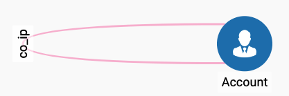

# 创建 Schema

本案例 Schema 部分非常简单，图中只有 Account 这一种节点，只考虑 IP 地址作为上下文的共现边:




```sql
/* Vertices */
CREATE VERTEX Account (PRIMARY_ID id STRING, cc_size INT, cc_update_time DATETIME)

/* Edges */
CREATE UNDIRECTED EDGE co_ip (FROM Account, TO Account, ip STRING, create_time DATETIME, time_diff INT)

/* Graph */
CREATE GRAPH MyGraph (*)
```


其中，为 Account 节点添加了 `cc_size` 与 `cc_update_time` 这两个属性。这里 cc 的含义和上一个案例是一样的，即 Connected Component。

为了实现更快的响应速度，更高的查询吞吐量，需要将 cc 的发现，与 cc 的查询分离开。譬如想查询某个账号所在的 cc 的大小，不能在接到查询请求的时候，从该账号出发去做深度遍历，而是应该提前将 cc 的信息计算好缓存在节点上，在接到查询请求的时候直接返回结果。

`cc_size` 用来存储该账号所在的 cc 的大小，`cc_update_time` 记录的是 `cc_size` 的最后更新时间，更新脚本判断如果当前账号的更新时间与当前时间距离很短，可以选择不更新。

