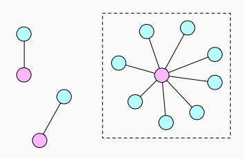

# 浅度分析

浅度分析的基本思想是，**先定位异常节点，再从异常节点出发寻找与之相关联的账号、订单**。


正常情况下，浅度关联分析并不一定需要图数据库，这里我们就当是热热身，回顾一下 GSQL 语法。同时读者们也可以对比一下，在浅度关联分析下，图数据库对比关系型数据库是否存在优势。




### 单个 IMEI 关联多个账号


```sql
CREATE QUERY find_risky_imeis(INT th_num_phones_per_imei=3) FOR GRAPH MyGraph {
  SetAccum<VERTEX> @@risky_imeis, @@risky_accounts, @@risky_orders;

  all_imeis = {IMEI.*};

  accounts =
    SELECT t
    FROM all_imeis:s -(use_imei:e)-> Account:t
    WHERE s.outdegree("use_imei") >= th_num_phones_per_imei
    ACCUM @@risky_imeis += s,
          @@risky_accounts += t
  ;

  orders =
    SELECT t
    FROM accounts:s -(send_bonus:e)-> BonusOrder:t
    ACCUM @@risky_orders += t
  ;

  PRINT @@risky_imeis AS imeis,
        @@risky_accounts AS accounts,
        @@risky_orders AS orders
  ;
}
```


通过 `outdegree("use_imei")` 获取一个设备关联的账户数，超过给定的阈值则认为是可疑设备，再通过 `use_imei` 与 `send_bonus` 来寻找可疑的账号与订单数。

### 单个账号接收过多其他账号的奖励


```sql
CREATE QUERY find_risky_order_recvrs(INT th_num_sendrs_per_recvrs=3) FOR GRAPH MyGraph {
  SetAccum<VERTEX> @order_sendrs;
  SetAccum<VERTEX> @@risky_recvrs, @@risky_accounts, @@risky_orders;
  all_accounts = {Account.*};

  orders =
    SELECT t
    FROM all_accounts:s -(send_bonus:e)-> BonusOrder:t
    ACCUM t.@order_sendrs += s
  ;

  recvrs =
    SELECT s
    FROM orders:s -(recv_bonus:e)-> Account:t
    ACCUM t.@order_sendrs += s.@order_sendrs
  ;

  _t0 =
    SELECT t
    FROM orders:s -(recv_bonus:e)-> Account:t
    WHERE t.@order_sendrs.size() >= th_num_sendrs_per_recvrs
    ACCUM @@risky_recvrs += t,
          @@risky_accounts += t.@order_sendrs,
          @@risky_orders  += s
  ;

  PRINT @@risky_recvrs AS recvrs,
        @@risky_accounts AS accounts,
        @@risky_orders AS orders
  ;
}
```


首先通过 `send_bonus` 边，将订单发送人记录在订单上的节点累加器上。然后通过 `recv_bonus` 边，将订单发送人信息，添加到订单接收人的节点累加器上。最后查看每个订单接收人，保留存在3个不同订单发送人的订单接收人，即可疑账号。


上面的实现方式可能有点儿绕，另外一种可能的设计，是在 Schema 中，直接建立一条 Account -\(send\_bonus\)-&gt; Account  边。大家也可以思考一下这两种设计上的区别以及各自的优缺点。


