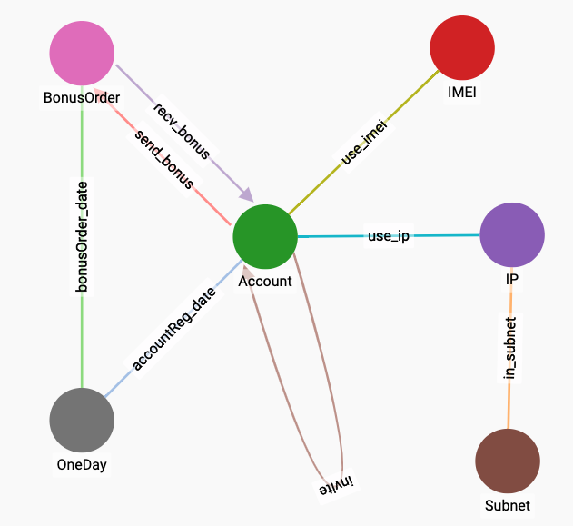

# 数据加载

### 数据预览

为了方便演示练习，本次案例所使用的数据，经过了如下前处理:

1. 手机号，IP地址，IP网段，做了id 化脱敏。
2. IMEI  做了 MD5 脱敏。
3. 时间做了顺序脱敏，整数数值表示从第一笔数据开始，经过的秒数，日期为从第一笔数据开始，经过的天数。因此时间、日期字段，不会影响先后关系与距离关系。
4. 将原始数据中的**邀请表**和**兑换表**，直接按照后续需要创建的边关系，拆分成了以下5个 jsonline 文件。



```javascript
{"phone":140,"imei":"b7ae8af4afd439a101911cb51b17a123"}
{"phone":141,"imei":"ac8384f232cad1fb00ea98002dd575de"}
{"phone":142,"imei":"7a9b347be6a38ab92fc25f25001e5224"}
{"phone":143,"imei":"e22e3a5be7169a01f8774754e1b2683c"}
{"phone":18392,"imei":"13ad4ddb1e8979386fcbcd94976c89ab"}
{"phone":145,"imei":"ab7b47f4da30d940b09e875df79a1053"}
{"phone":146,"imei":"8e8fc94121a33726c61c22592f09e9d9"}
...
```



```javascript
{"phone":140,"ip":1,"ip_subnet":1}
{"phone":141,"ip":2,"ip_subnet":2}
{"phone":142,"ip":3,"ip_subnet":3}
{"phone":143,"ip":4,"ip_subnet":4}
{"phone":145,"ip":5,"ip_subnet":5}
{"phone":146,"ip":6,"ip_subnet":6}
{"phone":147,"ip":7,"ip_subnet":7}
...
```



```javascript
{"order_id":1,"order_date":3039,"sendr_phone":1,"recvr_phone":1}
{"order_id":2,"order_date":3039,"sendr_phone":2,"recvr_phone":18369}
{"order_id":3,"order_date":3039,"sendr_phone":3,"recvr_phone":3}
{"order_id":4,"order_date":3039,"sendr_phone":4,"recvr_phone":4}
{"order_id":5,"order_date":3039,"sendr_phone":5,"recvr_phone":5}
{"order_id":6,"order_date":3039,"sendr_phone":6,"recvr_phone":6}
{"order_id":7,"order_date":3039,"sendr_phone":7,"recvr_phone":7}
...
```



```javascript
{"sendr_phone":7203,"recvr_phone":22330}
{"sendr_phone":7203,"recvr_phone":22331}
{"sendr_phone":7203,"recvr_phone":22332}
{"sendr_phone":7203,"recvr_phone":22333}
{"sendr_phone":7203,"recvr_phone":22334}
{"sendr_phone":7203,"recvr_phone":22335}
{"sendr_phone":7203,"recvr_phone":22336}
...
```



```javascript
{"phone":1,"reg_time":955,"reg_date":2919}
{"phone":18369,"reg_time":64951,"reg_date":2448}
{"phone":3,"reg_time":41682,"reg_date":2025}
{"phone":4,"reg_time":63357,"reg_date":2185}
{"phone":5,"reg_time":81518,"reg_date":2200}
{"phone":6,"reg_time":55242,"reg_date":2358}
{"phone":7,"reg_time":65107,"reg_date":2023}
...
```



### 创建 Data Loading Job

本次案例将使用 GSQL 脚本来创建 DDL，我将之前创建的 Schema 图放在下方，方便参考。



先来为 `orders.json` 数据创建 DDL， 这份文件提供的是 `Account -(send_bonus)-> BonusOrder -(recv_bonus)-> Account`  的信息。


```sql
USE GRAPH MyGraph

DROP JOB load_orders
CREATE LOADING JOB load_orders FOR GRAPH MyGraph {
    DEFINE FILENAME jsonfile;
    LOAD jsonfile
        TO VERTEX BonusOrder VALUES($"order_id", $"order_id", $"order_date"),
        TO EDGE send_bonus VALUES($"sendr_phone", $"order_id"),
        TO EDGE recv_bonus VALUES($"order_id", $"recvr_phone"),
        TO EDGE bonusOrder_date VALUES($"order_id", $"order_date")
    USING JSON_FILE="true";
}
```


`USE GRAPH MyGraph` 是在创建一个 DDL 之前必须声明的，表示当前这个 DDL 是为哪张图创建的。

`DROP JOB load_orders` 的目的是删除名称为`load_orders` 的 DDL，如果之前创建过的话。

`DEFINE FILENAME jsonfile` 将定义一个文件名变量 `jsonfile` ，后续在进行数据导入操作的时候，我们可以将该变量赋值为数据文件的路径。

后续的语句较为简单，通过 `$` 符号可以访问一条 json 数据中的字段值，并按照 Schema 中定义的属性的顺序，逐步将 json 数据中的字段与 Schema 中的点、边属性，对应起来。

`USING JSON_FILE="true"` 表明，当前数据文件为 json 格式。

接下来还需要为剩下的几个数据文件创建 DDL。


```sql
USE GRAPH MyGraph

DROP JOB load_refs
CREATE LOADING JOB load_refs FOR GRAPH MyGraph {
    DEFINE FILENAME jsonfile;
    LOAD jsonfile
        TO EDGE invite VALUES($"sendr_phone", $"recvr_phone")
    USING JSON_FILE="true";
}
```



```sql
USE GRAPH MyGraph

DROP JOB load_devices
CREATE LOADING JOB load_devices FOR GRAPH MyGraph {
    DEFINE FILENAME jsonfile;
    LOAD jsonfile
        TO EDGE use_imei VALUES($"phone", $"imei")
    USING JSON_FILE="true";
}
```



```sql
USE GRAPH MyGraph

DROP JOB load_reg_times
CREATE LOADING JOB load_reg_times FOR GRAPH MyGraph {
    DEFINE FILENAME jsonfile;
    LOAD jsonfile
        TO VERTEX Account VALUES($"phone", $"phone", $"reg_time", $"reg_date"),
        TO EDGE accountReg_date VALUES($"phone", $"reg_date")
    USING JSON_FILE="true";
}
```



```sql
USE GRAPH MyGraph

DROP JOB load_ips
CREATE LOADING JOB load_ips FOR GRAPH MyGraph {
    DEFINE FILENAME jsonfile;
    LOAD jsonfile
        TO EDGE use_ip VALUES($"phone", $"ip"),
        TO EDGE in_subnet VALUES($"ip", $"ip_subnet")
    USING JSON_FILE="true";
}
```


### 安装 DDL

编写并保存之后通过 GSQL 来安装 DDL

```bash
$ gsql load_orders_ddl.gsql
$ gsql load_refs_ddl.gsql
$ gsql load_devices_ddl.gsql
$ gsql load_reg_times_ddl.gsql
$ gsql load_ips_ddl.gsql
```

如果 `DDL` 脚本中首行没有写 `USE GRAPH MyGraph` 后续也可以通过参数 `-g` 来指定该脚本指代的图的名称:

```bash
$ gsql -g MyGraph xxx.gsql
```

这相当于在 `xxx.gsql` 的首行增加了 `USE GRAPH MyGraph`

可以通过 `SHOW JOB *` 来查看已经安装好的 `DDL`

```bash
$ gsql -g MyGraph "SHOW JOB *"
```

### 导入数据

#### 1. 通过载入服务器本地文件

将这几个数据文件放入服务器中 `/home/tigergraph/invite_graph_data` 下，以 `load_orders` 为例，通过 GSQL 来执行 DDL。

```bash
$ gsql -g MyGraph 'RUN LOADING JOB load_orders USING jsonfile="/home/tigergraph/invite_graph_data/orders.json"'
Connecting to 192.168.5.60
If there is any relative path, it is relative to tigergraph/dev/gdk/gsql
[Tip: Use "CTRL + C" to stop displaying the loading status update, then use "SHOW LOADING STATUS jobid" to track the loading progress again]
[Tip: Manage loading jobs with "ABORT/RESUME LOADING JOB jobid"]
Starting the following job, i.e.
  JobName: load_orders, jobid: MyGraph.load_orders.file.m1.1584426147535
  Loading log: '/home/tigergraph/tigergraph/logs/restpp/restpp_loader_logs/MyGraph/MyGraph.load_orders.file.m1.1584426147535.log'

Job "MyGraph.load_orders.file.m1.1584426147535" loading status
[FINISHED] m1 ( Finished: 1 / Total: 1 )
  [LOADED]
  +------------------------------------------------------------------------------------------+
  |                                      FILENAME |   LOADED LINES |   AVG SPEED |   DURATION|
  |/home/tigergraph/invite_graph_data/orders.json |          18921 |     18 kl/s |     1.01 s|
  +------------------------------------------------------------------------------------------+
```

#### 2. 通过 RESTful API  上传数据

很多时候，数据是实时产生的，需要及时更新的数据库中，可以考虑使用 HTTP 请求直接上传数据到数据库中。

TigerGraph 提供的 RESTful API，可以支持**单条数据上传**、**文件数据上传**。下面以 curl 为例演示 API 调用方法。

2.1 单条数据上传

```bash
$ curl -X POST --data '{"phone":140,"imei":"b7ae8af4afd439a101911cb51b17a123"}' "http://192.168.5.60:9000/ddl/MyGraph?tag=load_devices&filename=jsonfile"
```

API 的路径为 `/ddl/MyGraph` ，参数 `tag=load_devices` 指明了 DDL 的名称，`filename=jsonfile` 即文件名变量的名称。

2.2 文件数据上传

```bash
$ curl -X POST --data-binary @invite_graph_data/refs.json "http://192.168.5.60:9000/ddl/MyGraph?&tag=load_refs&filename=jsonfile"
$ curl -X POST --data-binary @invite_graph_data/devices.json "http://192.168.5.60:9000/ddl/MyGraph?&tag=load_devices&filename=jsonfile"
$ curl -X POST --data-binary @invite_graph_data/reg_times.json "http://192.168.5.60:9000/ddl/MyGraph?&tag=load_reg_times&filename=jsonfile"
$ curl -X POST --data-binary @invite_graph_data/ips.json "http://192.168.5.60:9000/ddl/MyGraph?&tag=load_ips&filename=jsonfile"
```


