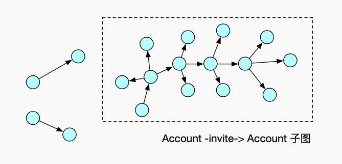
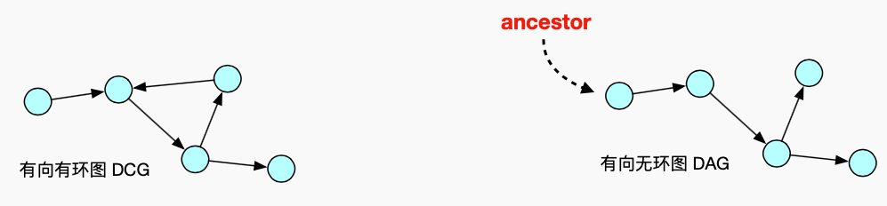
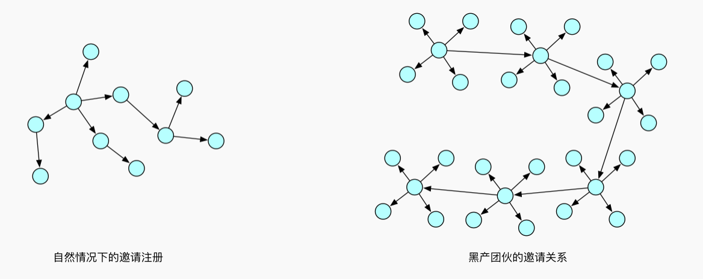
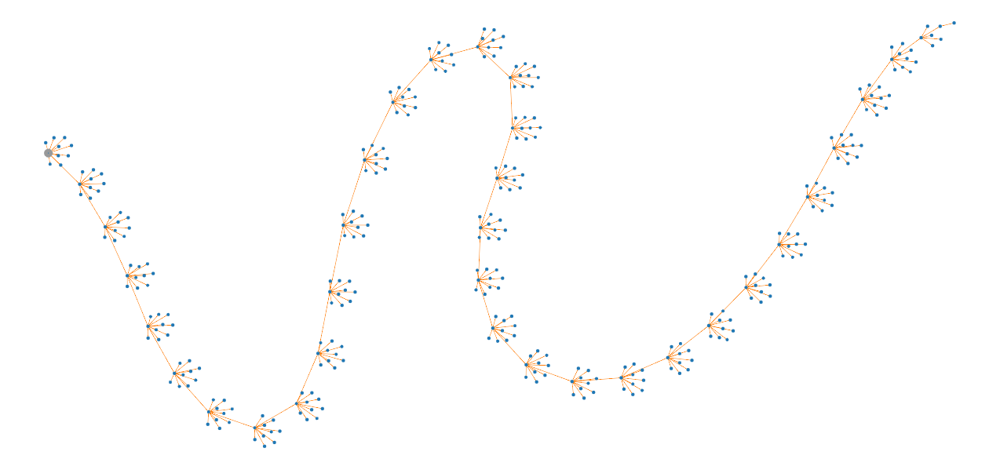
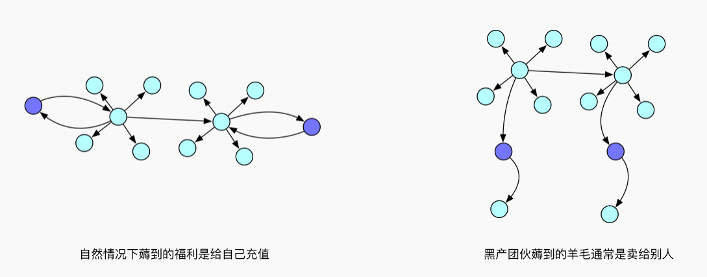
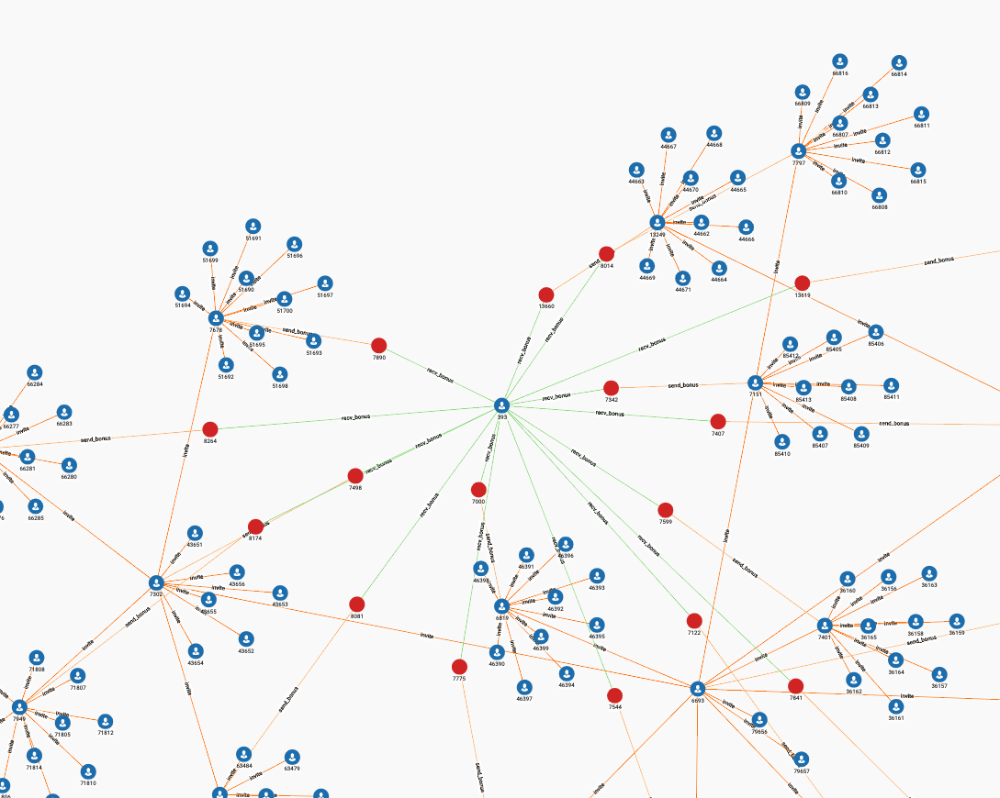

# 深度分析

深度分析的基本思想是，从某个类型的子图中寻找 **Connected Component** \( 连通分量，后简称 CC \), 对 CC 进行画像，定位出存在异常的 CC，再从这个 CC 出发寻找与之相关联的订单或其他节点。

在挑选子图时，尽可能选择一些强关联关系，比如**邀请关系**，邀请者与被邀请者是具体的，事实的存在。而像 `Account -(use_ip)-> IP`  这样的关联，并非稳定关系，尤其是在中国 IPv4 地址资源有限的环境下，绝大多数人上网使用的是动态 IP，一个 IP 在一段时间内可能为黑产所用，在另一段时间可能是一个正常用户在用。


关系的强弱稳定，在不同场景下，是不一样的，需要具体问题具体分析。读者也可以思考一下，在动态 IP 环境下，账户与IP之间的关联关系是否完全失去意义，是否可能有其他利用价值。这部分内容我们留到下一个案例来讨论，学完之后可能更能体会到，很多时候对业务的认识，采用适合的 Schema 设计，可以很大程度提升分析效率。


在这个案例中，我们所说到的 CC，特指由**邀请关系**构成的子图中的连通分量。



前面说到，因为成本效益的考虑，黑产团伙会尽可能资源使用成本，这样一来必然会在某些资源上出现共用，或者体现出一些独特的使用策略。

具体来说，在本案例中，我认为黑产团伙构成的 CC 可能具备如下特征:

1. CC 的深度过大
2. 一个 CC 中非**对己订单比例**很高
3. CC 中存在大量**设备共用**行为
4. CC 中的行为**疑似机器操作**

### 如何寻找 CC



在这个案例中，邀请关系构成的子图是一个**有向无环图 \( Directed Acyclic Graph \)**，在有向无环图中寻找 Connected Components，最简单的方法就是先寻找 CC 的祖先 \( ancestor \)，即某个 CC 中，唯一一个入度\( in-degree \)为 0 的节点。可以用祖先节点的 id，作为 CC 的 id。

寻找 CC 的方法如下，忽略不必要的代码部分:

```sql
...
MaxAccum<VERTEX> @ancestor; 
all_accounts = {Account.*}; 

ancestors =
  SELECT t
  FROM all_accounts:t
  WHERE t.outdegree("invite") > 0 AND 
        t.outdegree("reverse_invite") == 0 
  ACCUM t.@ancestor = t
;

children = ancestors;
WHILE (children.size() > 0) DO
  children =
    SELECT t
    FROM children:s -(invite:e)-> Account:t
    ACCUM t.@ancestor = s.@ancestor;
END;
...
```

使用一个节点累加器 `@ancestor` 来存储每个节点的祖先 id，这里用 **MaxAccum** 和 **MinAccum** 是一样的。第一次遍历，先寻找图中所有出度大于0，入度等于0的节点，令他们的 `@ancestor` 等于自己。然后从这些祖先出发，一步一步告诉自己的邻居，自己的祖先是谁。循环结束之后，全图所有的节点，都知道自己的祖先是谁。

### 深度过大的 CC

很多时候，由于活动规则的限定，加上黑产本身有避免被追踪的动机，黑产团伙会避免一个账号邀请过多的人。体现在图上，会发现黑产的邀请关系往往深度很大，在传统关系型数据库中，要计算一个邀请链条的深度，是一件开销很大的事情。当然，更深的邀请关系，还有成本效益上的考量，这点后面会再次提到。






```sql
CREATE QUERY comps_depth_rank(INT k) FOR GRAPH MyGraph {
  TYPEDEF TUPLE<VERTEX ancestor, INT depth> comp_depth;
  MaxAccum<VERTEX> @ancestor;
  ListAccum<VERTEX> @invite_chain;
  GroupByAccum<VERTEX ancestor, MaxAccum<INT> depth> @@comp_depth_stats;
  HeapAccum<comp_depth>(k, depth DESC) @@comps_depth_rank;

  all_accounts = {Account.*};
  
  /* 
  寻找所有 cc 的祖先
  */
  ancestors =
    SELECT t
    FROM all_accounts:t
    WHERE t.outdegree("invite") > 0 AND t.outdegree("reverse_invite") == 0
    ACCUM t.@ancestor = t
  ;
  
  /* 
  将祖先信息传递到所有节点，并在每个节点上记录从祖先出发到达该节点，中途经过的节点
  */
  children = ancestors;
  WHILE (children.size() > 0) LIMIT 30 DO
    children =
      SELECT t
      FROM children:s -(invite:e)-> Account:t
      ACCUM t.@ancestor = s.@ancestor,
            t.@invite_chain = (s.@invite_chain + [s])
    ;
  END;
  
  /*
  统计每个 cc 最深的邀请链条有多少层
  */
  _t0 =
    SELECT t
    FROM all_accounts:t
    ACCUM @@comp_depth_stats += (t.@ancestor -> t.@invite_chain.size())
  ;

  /*
  保留 top k 个最深的 cc，作为结果返回
  */
  FOREACH (ancestor, depth) IN @@comp_depth_stats DO
    @@comps_depth_rank += comp_depth(ancestor, depth);
  END;

  FOREACH c IN @@comps_depth_rank DO
    PRINT c.ancestor AS ancestor,
          c.depth AS depth
    ;
  END;
}
```




以 `k=10` 作为参数执行脚本，找出最深的 10 个 cc

```javascript
[
  {
    "ancestor": "1879",
    "depth": 30
  },
  {
    "ancestor": "2704",
    "depth": 30
  },
  {
    "ancestor": "5283",
    "depth": 30
  },
  {
    "ancestor": "2090",
    "depth": 30
  },
  {
    "ancestor": "361",
    "depth": 30
  },
  {
    "ancestor": "1275",
    "depth": 26
  },
  {
    "ancestor": "855",
    "depth": 24
  },
  {
    "ancestor": "5491",
    "depth": 22
  },
  {
    "ancestor": "1919",
    "depth": 19
  },
  {
    "ancestor": "5390",
    "depth": 16
  }
]
```



在之前的案例中，我们已经接触到了 **tuple** 和 **HeapAccum** 的用法。`TYPEDEF TUPLE` 定义一个 tuple 型数据结构，相当于 python 中的 **namedtuple**。他常常与 HeapAccum 配合使用，用来对结果进行排序，并保留最大或者最小的 K 个结果。

**GroupByAccum** 和  **MapAccum** 很类似，区别在于 GroupByAccum 的 key 是一些基础类型，value 是累加器，并且 key 和 value 都可以有多个。比如，你想分别统计全国所有城市，每个月份气温的最高值、最低值与平均值，你可以定义这样一个 GroupByAccum

```sql
GroupByAccum<
  STRING city, 
  STRING month, 
  MaxAccum<FLOAT> max_temp,
  MinAccum<FLOAT> min_temp,
  AvgAccum<FLOAT> avg_temp
> @@city_temp_stats;

...
@@city_temp_stats += ("北京", "1月" -> 0, 0, 0);
@@city_temp_stats += ("北京", "1月" -> -1, -1, -1);
...
@@city_temp_stats += ("北京", "2月" -> 5, 5, 5);
...
@@city_temp_stats += ("上海", "1月" -> 2, 2, 2);
...

// 访问 GroupByAccum 的几种方式

// 1. 获取上海2月平均气温
@@city_temp_stats.get("上海", "2月").avg_temp

// 2. foreach 遍历每个分组
FOREACH g IN @@city_temp_stats DO
  PRINT g.city, g.month, g.max_temp, g.min_temp, g.avg_temp
END;

// 3. foreach 遍历每个分组，类似 python 做一个 unpack
FOREACH (city, month, max_temp, min_temp, avg_temp) in @@city_temp_stats DO
  PRINT city, month, max_temp, min_temp, avg_temp
END;
```

下图展示的是发现的最深的一个 cc



### 非对己订单比例很高的 CC

正常情况下，用户邀请别人注册，得到的话费奖励，会给自己的手机号充值。黑产更多的则是拿出去变现，即消耗自己的积分给别的手机号充值，这里我们称之为**非对己订单**。一个 CC 中如果非对己订单比例很高，则该 CC 受控于黑产团伙的概率就很大。





```sql
CREATE QUERY comps_nonself_order_ratio_rank(INT min_num_orders, INT k) FOR GRAPH MyGraph {
  TYPEDEF TUPLE<VERTEX ancestor,
                INT num_orders,
                INT num_nonself_orders,
                DOUBLE nonself_order_ratio> tp_comp_stat;
  MaxAccum<VERTEX> @ancestor, @order_recvr;
  GroupByAccum<VERTEX ancestor,
               SumAccum<INT> num_orders,
               SumAccum<INT> num_nonself_orders> @@ancestor_order_counter;
  HeapAccum<tp_comp_stat>(k, nonself_order_ratio DESC) @@comps_stats;

  all_accounts = {Account.*};
  all_orders = {BonusOrder.*};
  
  /*
  寻找所有的祖先
  */
  ancestors =
    SELECT t
    FROM all_accounts:t
    WHERE t.outdegree("invite") > 0 AND t.outdegree("reverse_invite") == 0
    ACCUM t.@ancestor = t
  ;
  
  /*
  将祖先信息传播到所有节点
  */
  children = ancestors;
  WHILE (children.size() > 0) DO
    children =
      SELECT t
      FROM children:s -(invite:e)-> Account:t
      ACCUM t.@ancestor = s.@ancestor
    ;
  END;
  
  /*
  将奖励接收人信息，记录到 order 节点上
  */
  _t0 =
    SELECT t
    FROM all_orders:s -(recv_bonus:e)-> Account:t
    ACCUM s.@order_recvr = t
  ;
  
  /*
  对比奖励的发送人和接收人，分别统计每个 CC 的对己订单数与非对己订单数
  */
  _t1 =
    SELECT t
    FROM all_accounts:s -(send_bonus:e)-> BonusOrder:t
    ACCUM
      CASE
        WHEN s == t.@order_recvr
          THEN @@ancestor_order_counter += (s.@ancestor -> 1, 0)
        ELSE @@ancestor_order_counter += (s.@ancestor -> 1, 1)
      END
  ;
  
  /*
  按照非对己订单比例对 cc 进行排序
  */
  FOREACH (ancestor, num_orders, num_nonself_orders) IN @@ancestor_order_counter DO
    IF num_orders >= min_num_orders THEN
      @@comps_stats += tp_comp_stat(
        ancestor, num_orders, num_nonself_orders, 1.0 * num_nonself_orders / num_orders
      );
    END;
  END;

  FOREACH g IN @@comps_stats DO
    PRINT g.ancestor AS ancestor,
          g.num_orders AS num_orders,
          g.num_nonself_orders AS num_nonself_orders,
          g.nonself_order_ratio AS nonself_order_ratio
    ;
  END;
}
```



以 `k=10` ，`min_num_orders=10` 作为参数，执行该脚本

```javascript
[
  {
    "ancestor": "6597",
    "num_orders": 21,
    "num_nonself_orders": 21,
    "nonself_order_ratio": 1
  },
  {
    "ancestor": "2090",
    "num_orders": 52,
    "num_nonself_orders": 52,
    "nonself_order_ratio": 1
  },
  {
    "ancestor": "1837",
    "num_orders": 16,
    "num_nonself_orders": 16,
    "nonself_order_ratio": 1
  },
  {
    "ancestor": "2386",
    "num_orders": 11,
    "num_nonself_orders": 11,
    "nonself_order_ratio": 1
  },
  {
    "ancestor": "7729",
    "num_orders": 11,
    "num_nonself_orders": 11,
    "nonself_order_ratio": 1
  },
  {
    "ancestor": "7277",
    "num_orders": 15,
    "num_nonself_orders": 15,
    "nonself_order_ratio": 1
  },
  {
    "ancestor": "6582",
    "num_orders": 13,
    "num_nonself_orders": 13,
    "nonself_order_ratio": 1
  },
  {
    "ancestor": "7419",
    "num_orders": 10,
    "num_nonself_orders": 10,
    "nonself_order_ratio": 1
  },
  {
    "ancestor": "5954",
    "num_orders": 11,
    "num_nonself_orders": 11,
    "nonself_order_ratio": 1
  },
  {
    "ancestor": "2390",
    "num_orders": 16,
    "num_nonself_orders": 16,
    "nonself_order_ratio": 1
  }
]
```



这个部分没有什么新的知识点，新的语法是在 `ACCUM` 操作中使用 `CASE WHEN` 语句来做分支判断。我们为该查询定义了一个 `min_num_orders` 阈值参数，只有 CC 中的订单数超过阈值的，才会考虑。

下图展示的 CC，非对己订单比例为 1，可以看到，这个 CC 中各账号获得的奖励，都充值给了中间的那个账号。



### CC中存在大量设备共用

### CC的行为疑似机器操作

