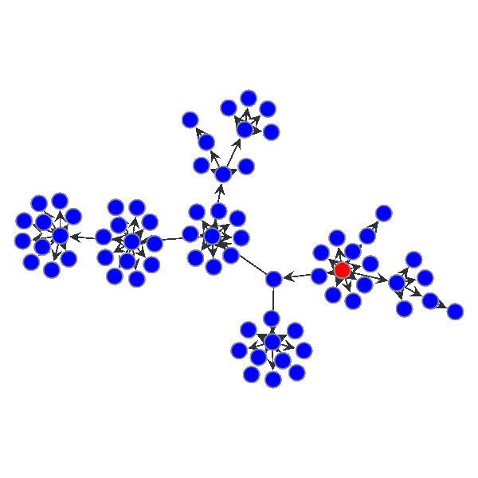

# 结果分析

### Ablation Test

以下列举的是利用本案例中提出的几个方法，利用图数据库进行黑产检测，得出的一些结果。

注: 以下结果针对的是营销活动全部数据进行的实验，案例中提供的脱敏数据时间跨度会略小一些

| 方法 | 规则 | 关联CC数量 | 关联账户数 | 关联订单数 |
| :--- | :--- | :--- | :--- | :--- |
| \(1\) | CC 深度 &gt; 5 | 103 | 18735 | 1691 |
| \(2\) | CC 订单数 &gt;= 10 and 非对己订单比例 &gt; 0.5 | 59 | 12653 | 1090 |
| \(3\) | CC 账户数 &gt;= 30 and 设备共用率 &gt; 2 | 11 | 3377 | 334 |
| \(4\) | CC 账户数 &gt;= 30 and 基尼系数 &lt; 0.1 | 257 | 20920 | 1848 |
|  |  |  |  |  |
| \(5\) | 1 个 IMEI 关联账户数 &gt;= 3 |  | 4763 | 2869 |
| \(6\) | 1 个账号接受 &gt;= 3 个不同账号的奖励 |  | 2391 | 2464 |
|  |  |  |  |  |
| \(7\) | 深度分析汇总 \(1\) + \(2\) + \(3\) + \(4\) | 289 | 30054 | 2648 |
| \(8\) | 浅度分析汇总 \(5\) + \(6\) |  | 5718 | 4396 |
| \(9\) | 深度与浅度分析汇总 \(7\) + \(8\) |  | 33346 | 5430 |
| \(10\) | 排除基尼系数的方法 \(7\) + \(8\) - \(4\) |  | 25760 | 5071 |

1. 本次营销活动发出去的奖励约 80 万。比较保守估计，有 3 万多个黑产账户，产生了 6000 多笔兑换，每笔订单平均损失 50 元，总损失金额预估 30 万。
2. 基于基尼系数的团伙识别方法需要进一步验证，如果排除该方法，估计有 2.5 万个黑产账户，涉及订单约 5600 多个，预估损失金额约 28.5 万。
3. 利用图分析方法，由于可以做更深层次的关联，可以发现大量浅层分析检测不出的黑产账号。

### 有意思的发现

前面利用基尼系数来衡量黑产团伙的机器行为，实际上还有个重要的因素可以考虑进来，就是注册的时间顺序。下面用来个 gif 动图来呈现:

大家也可以思考一下，黑产采取这种策略的动机是什么？

### 后续思考

1. 本次案例更多的是事后分析，事情已经发生了，损失已经产生了。在真实的生产环境中，黑产会对风控系统对干预做出应对。因此并不代表这上面检测出的损失，你都有办法完全避免。
2. 在实时场景下，我们更关注的可能是，数据库的更新速度，查询的响应速度，每秒的并发量等，这点才是**原生并行图数据库**的真正用武之地。毕竟如果制作离线图分析的话，完全可以用一些算法包，或者一些基于其他大数据平台的图分析引擎来实现，譬如 GraphX。
3. 实际上除了邀请关系之外，数据中很多关系没有使用到，譬如 IP 地址。然而在中国，因为大多数人使用的是动态 IP 资源，这意味着用户在断网重连时，IP 地址可能发生变化。一个 IP 地址可能前一个小时是黑产团伙在用，后一个小时就是一个正常用户在用，如果直接使用 IP 地址进行黑产团伙发现，可能产生大量的误报。如何利用这些信息，我们会在下一个案例中展开探讨。

