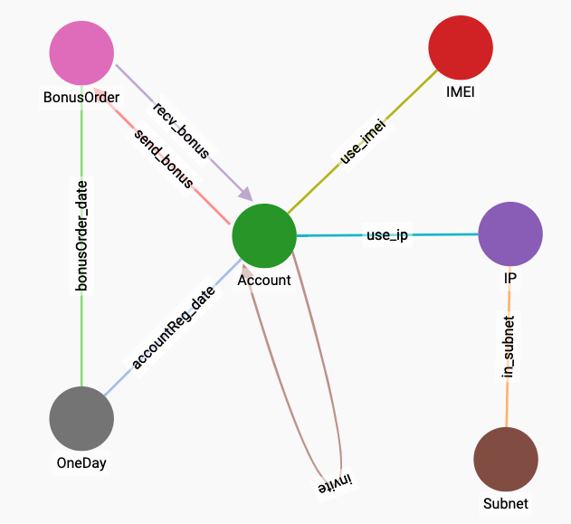

# 创建 Schema

观察本次案例将分析的数据，账号与账号之间有邀请、兑换关系，在发生邀请或者兑换事件时，日志中还记录了设备号\(IMEI\)，IP地址等信息，这些信息都可以构成图中的节点和边。在最新的关于图神经网络的一些 Paper 中，它被称作**异质图 \(Heterogeneous Graph\)**，但在维基百科中，**同质图 \(Homogeneous Graph\)** 与**异质图**却有另外但定义。我找了很久，并没有找到一个较为统一的说法，总而言之，这次案例所说的**异质图模型**，指的是在 Graph 中存在不同类型的节点。在 Schema 中，我们会把账号，IP，设备号等信息，都体现在节点上。


很多时候，场景不同，我们可以会采取不一样的 Schema。譬如 a 向 b 转账 10 元钱，就有如下两种可能的设计方式:

* Account:a -\(transfer\)-&gt; Order:o -\(transfer\)-&gt; Account:b
* Account:a -\(transfer:e\)-&gt; Account:b

在第一种模型中，可以将这笔转账的信息，比如金额，时间等，记录在节点 Order:o 的点属性中，如果 a 与 b 之间发生过多笔转账，则 a 与 b 之间将会存在多个 Order 节点

在第二种模型中，a 与 b 之间会有一条 transfer 边，可以将转账信息记录在边属性中。在 TigerGraph 中，两个节点之间**相同类型的边只能有一条**，也就是说，a 与 b 之间只能有一条 transfer 边，如果他们之间发生过多笔转账，可以将每次转账的信息记录用 list 的形式记录在 transfer:e 的边属性中。

不同的场景与分析需求，适合不同的设计，通过后续案例的学习，我们会更多体会到这一点


Schema 如下图:



本次案例使用 gsql 脚本来创建 Schema


```sql
CREATE VERTEX Account (PRIMARY_ID id STRING, phone STRING, reg_time INT, reg_date STRING) WITH STATS="outdegree_by_edgetype"
CREATE VERTEX IMEI (PRIMARY_ID id STRING, imei STRING) WITH STATS="outdegree_by_edgetype"
CREATE VERTEX IP (PRIMARY_ID id STRING, ip STRING) WITH STATS="outdegree_by_edgetype"
CREATE VERTEX Subnet (PRIMARY_ID id STRING, subnet STRING) WITH STATS="outdegree_by_edgetype"
CREATE VERTEX BonusOrder (PRIMARY_ID id STRING, order_id STRING, order_date STRING)
CREATE VERTEX OneDay (PRIMARY_ID id STRING) WITH STATS="outdegree_by_edgetype"

CREATE UNDIRECTED EDGE use_imei (FROM Account, TO IMEI)
CREATE UNDIRECTED EDGE use_ip (FROM Account, TO IP)
CREATE UNDIRECTED EDGE accountReg_date (FROM Account, TO OneDay)
CREATE UNDIRECTED EDGE in_subnet (FROM IP, TO Subnet)
CREATE UNDIRECTED EDGE bonusOrder_date (FROM BonusOrder, TO OneDay)

CREATE DIRECTED EDGE send_bonus (FROM Account, TO BonusOrder)
CREATE DIRECTED EDGE recv_bonus (FROM BonusOrder, TO Account)
CREATE DIRECTED EDGE invite (FROM Account, TO Account) WITH REVERSE_EDGE="reverse_invite"

CREATE GRAPH MyGraph (*)
```


使用 `CREATE VERTEX` 来创建节点，`WITH STATS = "outdegree_by_edgetype"` 的作用是让 TigerGraph 自动提前统计每个节点各种类型的边的数量，如果后续的查询语句会大量用到节点的 degree 信息，开启这个选项可以使查询的速度加快。

使用 `CREATE DIRECTED | UNDIRECTED EDGE` 来创建边，需要指定边的左右两边的点类型。如果需要增加边属性，可以写在 FROM, TO 之后。

使用 `CREATE GRAPH MyGraph (*)` 会将当前所有类型的点和边都包含进一张图中，该图成为 MyGraph


degree \(度\) 是图分析中一个重要的统计量，一个点的 degree 即从该点出发的一度邻居数量。因为图中存在多重不同的边，因此可以按类别分别统计 degree。


最后通过 GSQL 完成 Schema 创建:

```bash
$ gsql "DROP ALL" # 清除之前图数据库中所有信息，还原初始状态
$ gsql create_graph.gsql
```

