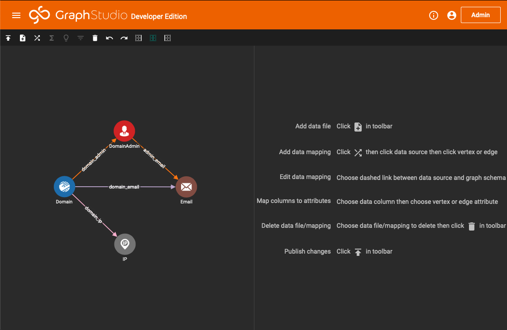
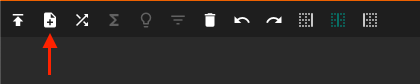
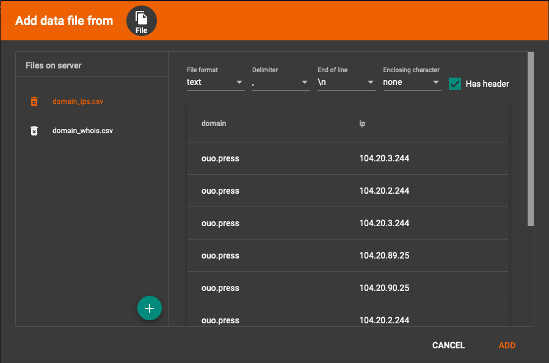
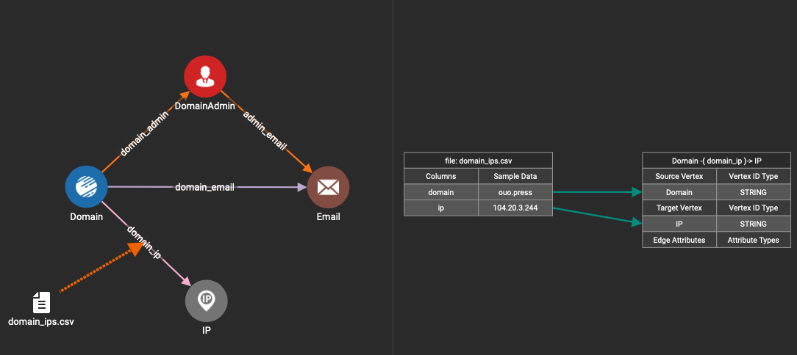
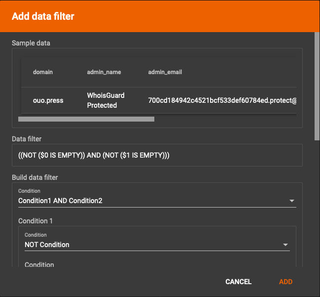
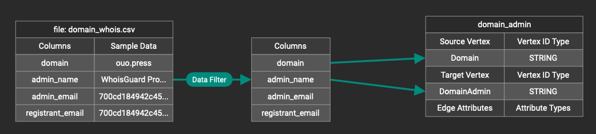
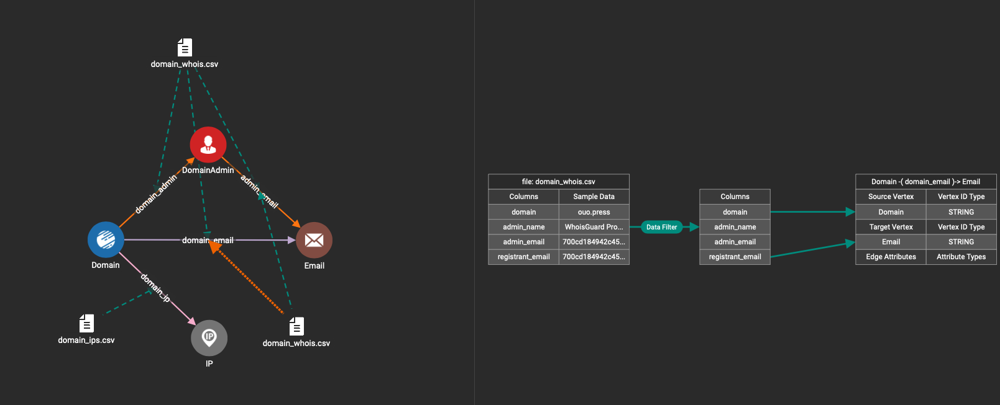
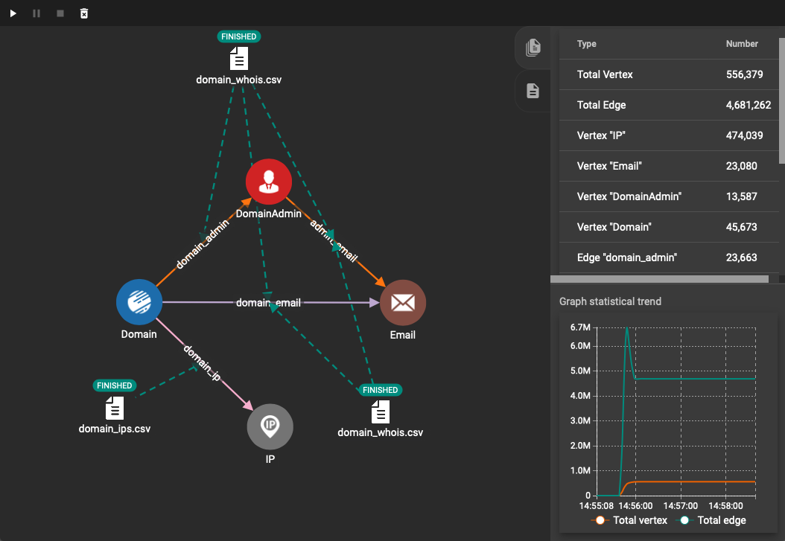

# 数据加载

## 准备工作

将外部数据导入到 TigerGraph 中，需要两个步骤。第一步是创建 Data Loading Job \( **DDL** \)，第二步则是执行 **DDL**。创建 Data Loading Job，即设定好原始数据中各个字段与 Schema 之间的映射关系。


目前 TigerGraph 支持的**数据源**有这么几种，可以从文件导入，用 HTTP Request 导入，也可以从 Kafka 导入。

目前 TigerGraph 支持的**数据格式**有 CSV 和 JSON


本案例的数据源为文件，数据格式为 CSV，在 Graph Studio 中创建 DDL。后续案例将会展示其他更灵活的方式。

在开始之前，需要将之前处理好的两个文件 `domain_ips.csv` 与 `domain_whois.csv`复制到 TigerGraph 服务器上的 `/home/tigergraph/tigergraph/loadingData` 目录下。如果是以 Docker 方式运行的，可以用 `docker cp` 将这两个文件复制到容器内:

```bash
$ docker cp domain_ips.csv tigergraph:/home/tigergraph/tigergraph/loadingData/
$ docker cp domain_whois.csv tigergraph:/home/tigergraph/tigergraph/loadingData/
```

## 创建 Data Loading Job

在 GraphStudio 的侧边栏，选择 Map Data To Graph，打开 DDL 创建页面



点击**添加文件**按钮



可以看到之前上传的那两个文件，先选择 `domain_ips.csv`



根据数据格式，选择好对应的配置，因为之前处理的 CSV 文件是有表头的，则需要勾选 Has header 选项。预览之后没问题了，点击 ADD。

接着点击工具栏中的按钮 **map data file to vertex or edge**。先点击 `domain_ips.csv` 文件，再点击 `domain_ip` 边，表示 `domain_ip` 边的数据从 `domain_ips.csv` 这份文件来。此时界面的右侧将出现 CSV 文件的 Columns 与边的定义，将 domain 这一列关联到这条边的起始节点 Domain 上，将 ip 这一列关联到目标节点 IP 上。



`domain_whois.csv` 文件的映射，和 `domain_ips.txt` 类似，但需要注意的是，`domain_whois.csv` 中某些字段存在缺失值的情况，这里需要做一下数据过滤。在连接好 `domain_whois.csv` 与 `domain_admin` 边之后，点击工具栏上的 **Data Filter**



此时会出现一个图像化的规则编辑器，如上图所示，如果 **domain** 字段或 **admin\_name** 字段出现了空值，那么这一行的数据将被忽略。这里 $0 与 $1 代表了列编号。完成了数据过滤之后，按照前面的方法，将 Columns 和 Edge 进行关联。



因为 `Email` 节点的来源可能是 CSV 文件中的 `admin_email` 与 `registrant_email` ，因此这里拖两个 `domain_whois.csv` 文件到界面中，分别做好映射。



再三检查映射工作无误后，点击工具栏中的 **Publish data mapping**，提交 DDL。


对于一些复杂的 DDL 来说，图形界面并不是一个很好的创建方式，在将来的案例中我们会利用 GSQL 脚本来完成 DDL 的创建。


## 执行 Data Loading Job

在侧边栏上点击 Load Data，然后点击工具栏上的 **Start/Resume loading** 按钮



很快就完成了数据导入工作，界面右上角可以看到各类节点与边的统计信息。

