# 用GSQL写图遍历算法

前面体验了如何利用 GraphStudio 的交互式分析功能，很快的找到了有价值的线索，并且简单学习了一下 GSQL 语言的基础语法。下面我们用 GSQL 来实现一些简单的图遍历算法，它可以帮助溯源工作更加高效，同时利用这几个实例，进一步掌握并熟悉 GSQL。

### 查询 k 步邻居



```sql
CREATE QUERY k_step_neighbors(VERTEX d, int k_step) FOR GRAPH MyGraph {
	SetAccum<EDGE> @@edges; // global accumulators
	OrAccum @visited = FALSE; // vertex-attached accumulators
  
	seed = {d};
  FOREACH i in RANGE[1, k_step] DO
	  seed = SELECT nb FROM seed-(:e)->:nb
	         WHERE nb.@visited == FALSE
	         ACCUM @@edges += e, nb.@visited += TRUE;	
	END;
	PRINT @@edges;
}
```



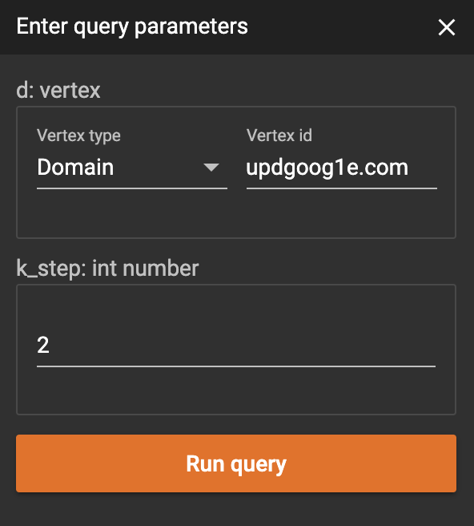



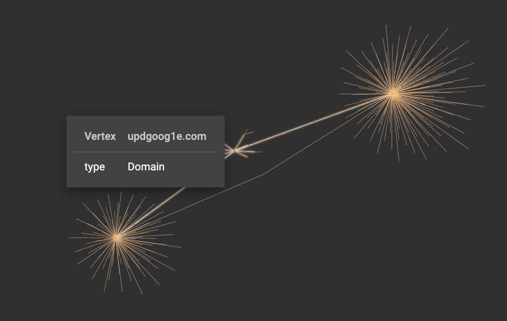



`SetAccum` 顾名思义，往里面添加的元素会去重，将中间遍历到的边，添加到 `@@edges` 里，是因为在之后 PRINT 的时候，可以直接在 GraphStudio 看到可视化结果。

`seed` 是一个 Vertex Set，一开始里面只有一个元素，就是我们的参数 `VERTEX d` 。然后是一个 FOR 循环，重复 `k_step` 次。通过节点累加器 `@visited` 的目的是，避免遍历到已经访问过的节点，这个技巧以后会多次使用到。

观察结果，可以发现，当遍历到一些超级节点 \( 该节点的 degree 很大 \) 时，返回的结果过多，当 `k=2` 时，结果的数量已经令人头大了。

### 查询 k 步邻居，对 Vertex Degree 进行限制



```sql
CREATE QUERY k_step_neighbors_v2(VERTEX d, int k_step, int max_degree) FOR GRAPH MyGraph {
	SetAccum<EDGE> @@edges;
	OrAccum @visitied = FALSE;
	
  seed = {d};
  FOREACH i in RANGE[1, k_step] DO
    seed = SELECT nbr 
	         FROM	seed:src-(:e)->:nbr
           WHERE nbr.@visitied == FALSE and nbr.outdegree() < max_degree
	         ACCUM nbr.@visitied += TRUE,
	               @@edges += e;
	END;
	PRINT @@edges;
}
```









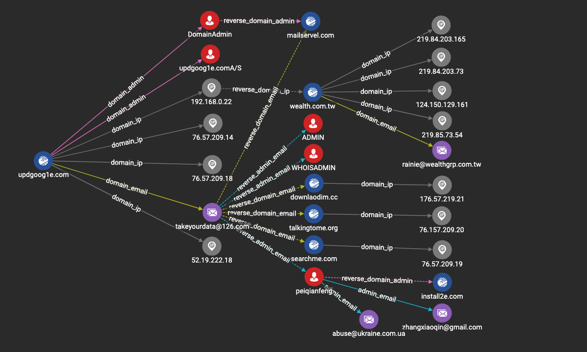

| num\_hits | precision | recall | f-score |
| :--- | :--- | :--- | :--- |
| 15 | 0.58 | 0.83 | 0.68 |



和之前 `k_step_neighbors` 几乎一样，但限制了目标节点的最大 degree，避免往超级节点上遍历。

### 查询 k nearest neighbors \( pre-defined distance \)

前面的 `k_step_neighbors` 不管是什么类型的边，都往外走 k 步，但事实上我们知道，不同类型的关系，其强弱亲疏程度是不一样的。譬如，一个域名变更IP地址解析的频率，就比一个域名变更whois中管理员信息的频率要高，因此 `domain_ip` 与 `domain_admin` 的亲密程度是不一样的。如果用**距离**来衡量关系强弱，根据经验，应该有:

`distance( domain, ip ) > distance( domain, admin) = distance( domain, email ) > distance( admin, email )`

这种方法，可以不限制查询的深度，只需要限定最终结果的数量。



```sql
CREATE QUERY k_nearest_neighbors(VERTEX src, INT max_num_edges, INT max_depth) FOR GRAPH MyGraph {
	TYPEDEF TUPLE<EDGE e, FLOAT dist> edge_result;
	TYPEDEF TUPLE<VERTEX v, FLOAT dist> vertex_result;
	
	MapAccum<STRING, FLOAT> @@dist_map;
	OrAccum @visited = FALSE;
	MinAccum<FLOAT> @dist;
  HeapAccum<edge_result>(max_num_edges, dist ASC) @@edge_results;
	HeapAccum<vertex_result>(max_num_edges, dist ASC) @@vertex_results;
	
	@@dist_map += ("domain_ip" -> 1.0);
	@@dist_map += ("reverse_domain_ip" -> 1.5);
	@@dist_map += ("domain_admin" -> 0.5);
	@@dist_map += ("reverse_domain_admin" -> 0.5);
	@@dist_map += ("domain_email" -> 0.5);
	@@dist_map += ("reverse_domain_email" -> 0.5);
	@@dist_map += ("admin_email" -> 0.25);
	@@dist_map += ("reverse_admin_email" -> 0.25);
	
	seed = {src};
	t = SELECT s FROM seed:s ACCUM s.@visited = TRUE, s.@dist = 0;
	
	WHILE seed.size() > 0 LIMIT max_depth DO
	  seed = SELECT tgt
	         FROM seed:s-(:e)->:tgt
	         WHERE tgt.@visited == FALSE and @@dist_map.containsKey(e.type) and tgt.outdegree() < 10
	         ACCUM 
	           tgt.@visited += TRUE,
	           tgt.@dist += s.@dist + @@dist_map.get(e.type),
	           @@edge_results += edge_result(e, s.@dist + @@dist_map.get(e.type))
	         POST-ACCUM
	           @@vertex_results += vertex_result(tgt, tgt.@dist);
	  PRINT seed.size();
	END;
	
	PRINT @@vertex_results;
	PRINT @@edge_results;
}
```



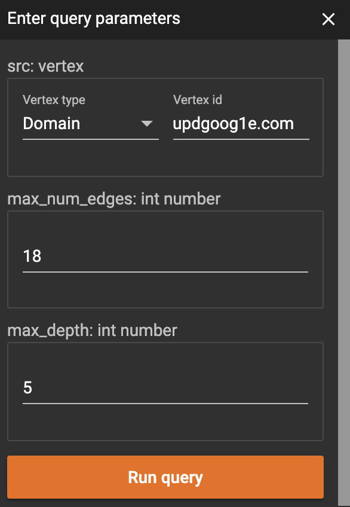



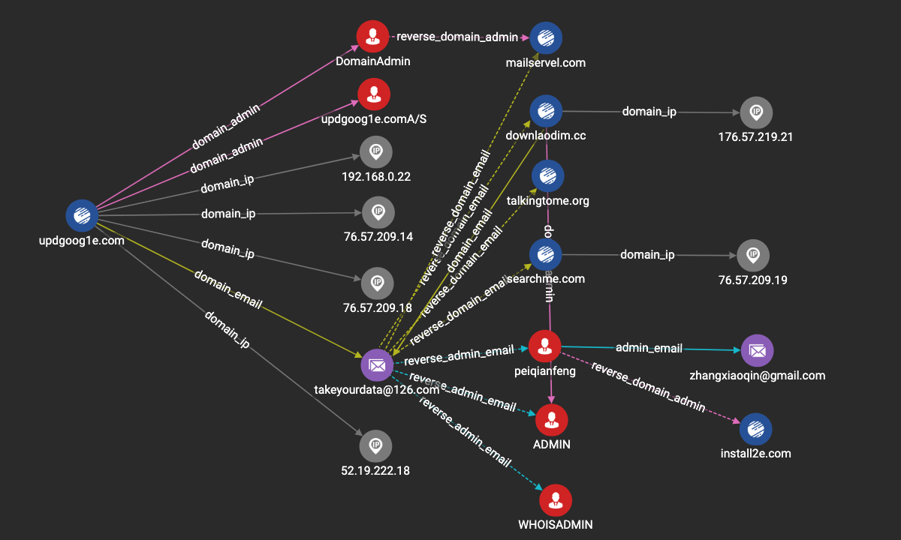

| num\_hits | precision | recall | f-score |
| :--- | :--- | :--- | :--- |
| 14 | 0.78 | 0.78 | 0.78 |



这里我们要学习到一个新的，很有用的累加器 `HeapAccum` ，对堆排序有了解的朋友，应该很容易理解，`HeapAccum` 实际上是一个容量有限的堆，里面的元素按照顺序排序，堆会按顺序保留最大或最小的N个元素。要用到 `HeapAccum` 首先需要定义一个 `TUPLE` ，和 Python 里的 tuple 是一个意思。

`HeapAccum(max_num_edges, dist ASC) @@vertex_results;` 即声明一个堆，名字叫 `@@vertex_results`，里面最多存放 `max_num_edges` 个 `vertex_result` 元素，并按照 `dist` 升序排序。这代表我们将寻找距离初始节点距离最近的 N 个元素。

另外还将用到一个很有用的累加器 `MapAccum` ，这里将他当做一个字典 \(dict\) 使用，用来存放不同实现给定的不同类型的边的距离。

### 查询 k nearest neighbors \( log degree distance \)

上面利用事先给定的距离定义，寻找距离初始节点最近的N个节点，效果有一定的提升，但缺点是参数量太多，距离定义的不好，很大程度会影响遍历的结果。

回到溯源这件事儿来，在交互式分析的时候咱们是怎么做的，我们会先展开信息量大的节点

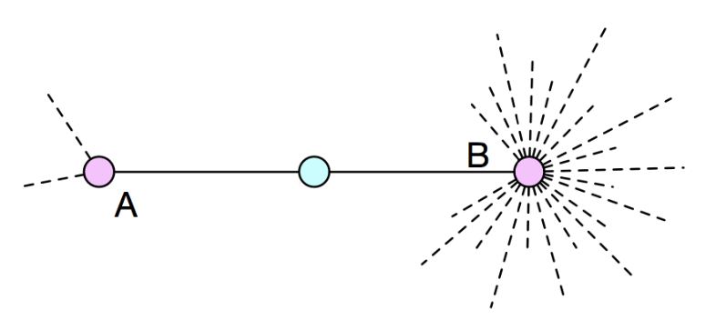

A 点的不确定性小 \(信息量大\)，因此往 A 点继续溯源下去，意义较大，因此可以用 degree 来衡量这种不确定性:

* degree 越大，不确定性越大，信息量越小
* degree 越小，不确定性越小，信息量越大

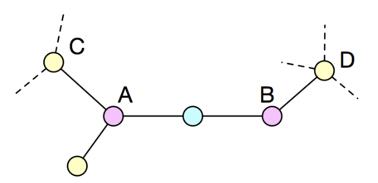

对于 n 步\( n&gt;2 \)以外的节点，如上图 C 点和 D 点，除了了要考虑当前节点的出度外，还需要考虑来源节点的出度，对于C来说，来源节点是 A，D 的来源节点是 B。

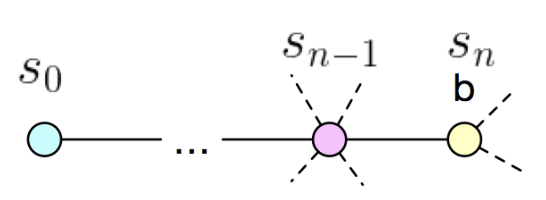

更加一般化，我们可以利用 degree，定义如下的距离公式:

$$
dist(s_0,s_n)=dist(s_0, s_{n-1}) + ln(degree(s_n))
$$



```sql
CREATE QUERY k_nearest_neighbors_v2(VERTEX src, INT max_num_edges, INT max_depth) FOR GRAPH MyGraph {
	TYPEDEF TUPLE<EDGE e, FLOAT dist> edge_result;
	TYPEDEF TUPLE<VERTEX v, FLOAT dist> vertex_result;
	
	MapAccum<STRING, FLOAT> @@dist_map;
	OrAccum @visited = FALSE;
	MinAccum<FLOAT> @dist;
  HeapAccum<edge_result>(max_num_edges, dist ASC) @@edge_results;
	HeapAccum<vertex_result>(max_num_edges, dist ASC) @@vertex_results;
	
	seed = {src};
	t = SELECT s FROM seed:s ACCUM s.@visited = TRUE, s.@dist = 0;
	
	WHILE seed.size() > 0 LIMIT max_depth DO
	  seed = SELECT tgt
	         FROM seed:s-(:e)->:tgt
	         WHERE tgt.@visited == FALSE
	         ACCUM 
	           tgt.@visited += TRUE,
	           tgt.@dist += s.@dist + LOG(tgt.outdegree()),
	           @@edge_results += edge_result(e, s.@dist + LOG(tgt.outdegree()))
	         POST-ACCUM
	           @@vertex_results += vertex_result(tgt, tgt.@dist);
	END;
	
	PRINT @@vertex_results;
	PRINT @@edge_results;
}
```



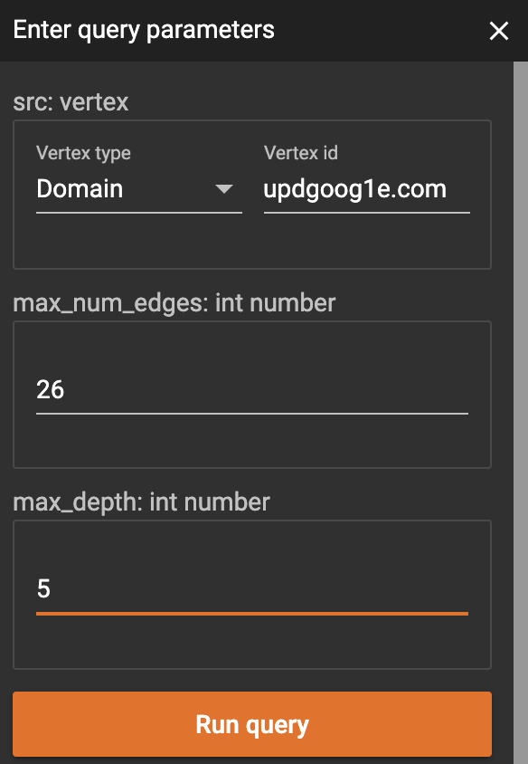



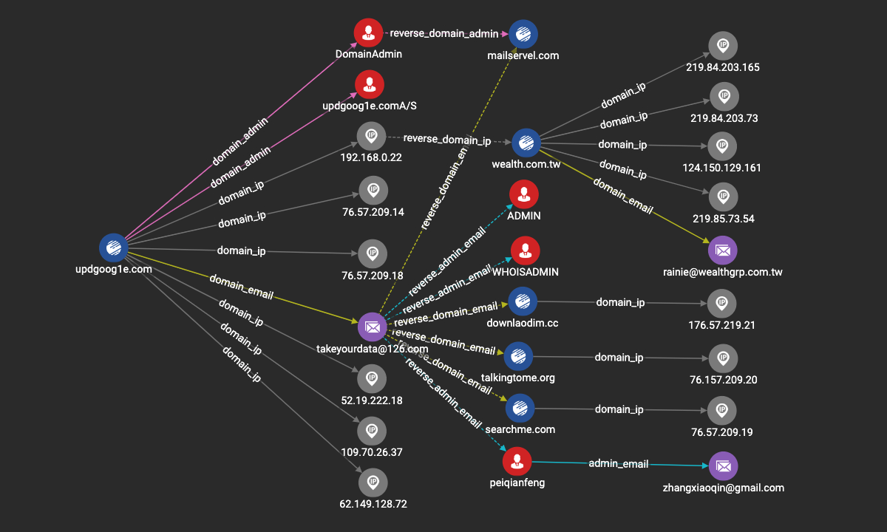

| num\_hits | precision | recall | f-score |
| :--- | :--- | :--- | :--- |
| 16 | 0.62 | 0.88 | 0.73 |



嘿，这里你可以会问，degree 之前为啥要取个 log ? 实际上，一个节点的 degree，等价于从该节点出发，随机遍历到一步，落到某个邻居上的概率:

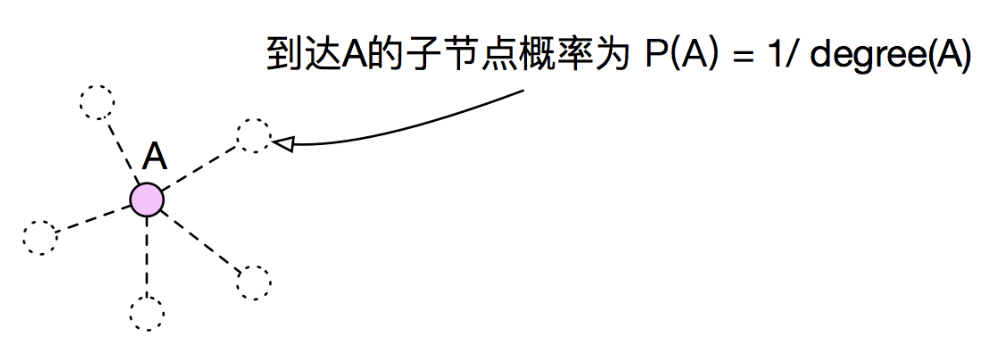

那么就有:

$$
\begin{matrix}
\begin{aligned}
dist(s_0, s_n)&=  dist(s_0, s_{n-1}) + ln(degree(s_n)) \\ 
&= dist(s_0, s_{n-1})  + ln(\frac{1}{P(s_n)})  \\ 
&= dist(s_0, s_0) + ln(\frac{1}{P(s_1)}) + \cdots +  ln(\frac{1}{P(s_n)}) \\
&= 0 + ln(\frac{1}{P(s_1)\times P(s_2) \times \cdots \times P(s_n)}) \\
&= -ln(P(s_1)\times P(s_2)\times \cdots \times P(s_n))
\end{aligned}
\end{matrix}
$$

因此，某节点与初始节点的距离越⼩，代表从初始节点出发，随机游⾛至该节点的某个子节点的概率越大。寻找距离初始节点最近的 K 个节点，等价于寻找从初始节点随机游⾛会经过的概率最⼤的 K 个节点。

