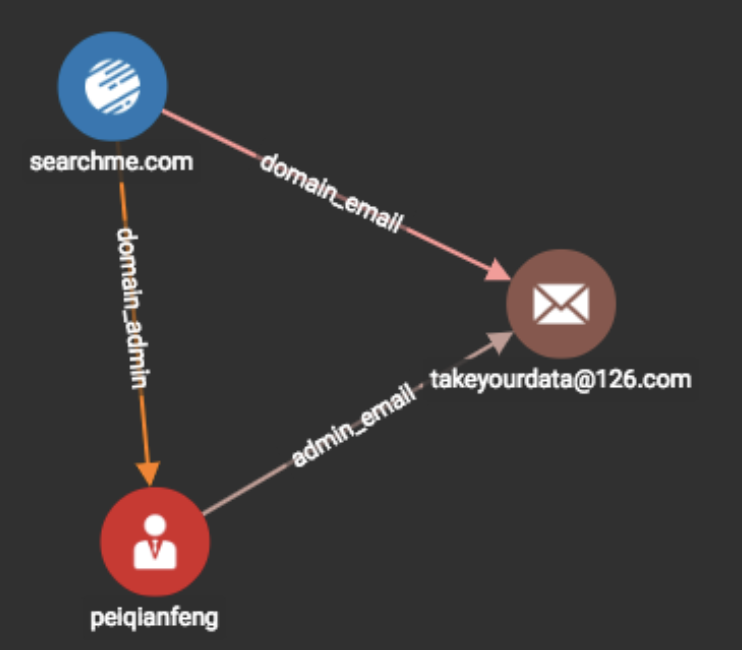

# 简单上手GSQL

TigerGraph 使用 GSQL 作为其图查询语言，GSQL 语言风格既有声明式\( declarative \)语言的特点，又有命令式 \( imperative \) 的特点，可以很方便发起并控制图遍历的过程。我个人认为 GSQL 是目前最棒的图查询语言，但是对于许多人来说，官网文档学习起来可能不是那么轻松，这也是我写这个教程的主要目的之一。

在左侧导航栏中选择 **Write Queries**，点击 + 可以创建一个新的查询脚本。在编写完脚本之后，点击顶部工具栏的 **Save query draft**, 如果语法正确无误，则可以点击 **Install query**，脚本编译成功之后，可以点击工具栏中的 **Run query** 执行该脚本。

### Hello World

```sql
CREATE QUERY hello_world(/* Parameters here */) FOR GRAPH MyGraph { 
  all_domains = {Domain.*};
	result =
	  SELECT tgt
	  FROM all_domains:src -(domain_ip:e)-> IP:tgt
	  LIMIT 5
	;
	PRINT result;
}
```

GSQL 的查询语句类似函数，可以传入自定义参数。在开始图遍历之前，需要定义好一个 Vertex Set。

`all_domains = {Domain.*};`的意思是，`all_domains` 中将包含数据库中所有的 Domain 节点。

最简单的图遍历语句由 SELECT - FROM 构成，每做一次 SELECT - FROM，就是从一个 Vertex Set 开始，寻找满足 Pattern 的一步邻居


Neo4J 用的 Cypher 语言，以及新版的 GSQL，允许你一次进行多跳 \( multi-hop \) 查询，但就我个人而言，我觉得是没有任何必要的。每次只做 1 跳查询，外部配合 For loop 完成多跳查询，可以拥有更多的自由度。除此之外很多复杂的查询逻辑，是很难通过多跳 Pattern Matching 来达到的，也会使得代码不易读。


上面这个 pattern `all_domains:src -(domain_ip:e)-> IP:tgt` 的意思是，遍历所有从 `all_domains` 这个点集合出发的，类型为 `domain_ip` 的，邻居类型为 `IP` 的边。`:` 后面是一个 alias，后续你可以通过他们获取到每个符合该 pattern 的边的起始节点，边，目标节点的属性。alias 的名字可以自由定义。

SELECT 后面跟了个 alias `tgt` ，结合 FROM 后面的 pattern，可以看出，它想要把所有符合该 pattern 的目标节点选取出来，存放到 result 中。

### Accumulators 累加器

累加器的作用是存储一些中间运算结果。通过下面这个例子， 来直观感受一下各种累加器的作用:



```sql
CREATE QUERY accumulators(/* Parameters here */) FOR GRAPH MyGraph {
	// global accumulators
	SumAccum<INT> @@sum_accum;
	MinAccum<INT> @@min_accum;
	MaxAccum<INT> @@max_accum;
	OrAccum @@or_accum;
	AndAccum @@and_accum;
	ListAccum<INT> @@list_accum;
	
	@@sum_accum += 1;
	@@sum_accum += 2;
	PRINT @@sum_accum;
	
	@@min_accum += 1;
	@@min_accum += 2;
	PRINT @@min_accum;
	
	@@max_accum += 1;
	@@max_accum += 2;
	PRINT @@max_accum;
	
	@@or_accum += TRUE;
	@@or_accum += FALSE;
	PRINT @@or_accum;
	
	@@and_accum += TRUE;
	@@and_accum += FALSE;
	PRINT @@and_accum;
	
	@@list_accum += 1;
	@@list_accum += 2;
	@@list_accum += [3, 4];
	PRINT @@list_accum;
}
```



```bash
[
  {
    "@@sum_accum": 3
  },
  {
    "@@min_accum": 1
  },
  {
    "@@max_accum": 2
  },
  {
    "@@or_accum": true
  },
  {
    "@@and_accum": false
  },
  {
    "@@list_accum": [
      1,
      2,
      3,
      4
    ]
  }
]
```



### 全局累加器 v.s. 节点累加器

所有累加器的命名必须以 @ 符号开始，其中以 1个 @ 符号开始的表示它是一个节点累加器 \( Vertex-attached Accumulator\)，以 2 个 @ 符号开始的表示它是一个全局累加器 \( Global Accumulator\)。

同样的，用一个具体的例子来感受一下二者的区别。



```sql
CREATE QUERY global_and_vertex_accumulators(VERTEX<Domain> domain) FOR GRAPH MyGraph { 
  SumAccum<INT> @@global_cnt = 0;
	SumAccum<INT> @vertex_cnt = 0;
	
	domains = {Domain.*};
	
	nbrs = SELECT tgt
	       FROM domains:src-()->:tgt
	       WHERE src == domain
	       ACCUM tgt.@vertex_cnt += 1, @@global_cnt += 1;
	
	PRINT @@global_cnt;
	PRINT nbrs.@vertex_cnt;
}
```



```bash
[
  {
    "@@global_cnt": 9
  },
  {
    "nbrs": [
      {
        "v_id": "62.149.128.72",
        "v_type": "IP",
        "attributes": {
          "nbrs.@vertex_cnt": 1
        }
      },
      {
        "v_id": "76.57.209.18",
        "v_type": "IP",
        "attributes": {
          "nbrs.@vertex_cnt": 1
        }
      },
      {
        "v_id": "192.168.0.22",
        "v_type": "IP",
        "attributes": {
          "nbrs.@vertex_cnt": 1
        }
      },
      {
        "v_id": "76.57.209.14",
        "v_type": "IP",
        "attributes": {
          "nbrs.@vertex_cnt": 1
        }
      },
      {
        "v_id": "52.19.222.18",
        "v_type": "IP",
        "attributes": {
          "nbrs.@vertex_cnt": 1
        }
      },
      {
        "v_id": "109.70.26.37",
        "v_type": "IP",
        "attributes": {
          "nbrs.@vertex_cnt": 1
        }
      },
      {
        "v_id": "takeyourdata@126.com",
        "v_type": "Email",
        "attributes": {
          "nbrs.@vertex_cnt": 1
        }
      },
      {
        "v_id": "updgoog1e.comA/S",
        "v_type": "DomainAdmin",
        "attributes": {
          "nbrs.@vertex_cnt": 1
        }
      },
      {
        "v_id": "DomainAdmin",
        "v_type": "DomainAdmin",
        "attributes": {
          "nbrs.@vertex_cnt": 1
        }
      }
    ]
  }
]
```



这是一个带参数的 query，调用的时候，我们将传入一个类型为 Domain 的节点 ID \(这里ID就是域名\)。这个 query 会将 `Domain` 类型的节点作为起始节点，去匹配任意一种关系的 1 步邻居，通过 WHERE 语句，只保留起始节点和传入的 domain 相同的边。因此，可以发现，通过 FROM 和 WHERE 都可以控制我们的遍历逻辑，放一块看，表达的意思是，找到所有从参数中给定的一个 domain 出发的所有 1 步邻居。接着对所有满足这样 pattern，依次做 ACCUM 语句中的累加操作，每次累加操作将节点累加器 `@vertex_cnt` 加 1， 将全局累加器 `@@global_cnt` 加 1。

假如我们用 `updgoog1e.com` 作为参数，执行该 query。观察输出，可以发现，满足该 pattern 的边有 9 条，因此 ACCUM 会被执行 9 次，`@@global_cnt = 9` ，这 9 条从 `updgoog1e.com` 出发的边，其目标节点是 9 个不一样的节点，每个节点的节点累加器都被加过 1 次，因此结果 `nbrs` 中包含了 9 个节点，每个节点的 `@vertex_cnt = 1` 。


注意到这里我们写 FROM 语句的 pattern时，没有写边类型，以及目标节点类型，这代表只要是从 domains 出发的所有边，都会被考虑进来


### ACCUM v.s POST-ACCUM

在 SELECT + FROM 遍历语句中，有 2 个地方可以进行累加操作，一个是 ACCUM，另一个是 POST-ACCUM，同样先用例子来感受一样二者的区别。



```sql
CREATE QUERY accum_vs_post_accum(VERTEX<DomainAdmin> admin, VERTEX<Domain>domain) FOR GRAPH MyGraph { 
  SumAccum<INT> @accum_cnt;
	SumAccum<INT> @post_accum_cnt;
	
  seed = {admin, domain};
	nbrs = SELECT tgt
	       FROM seed:src-()->:tgt
	       ACCUM tgt.@accum_cnt += 1
	       POST-ACCUM tgt.@post_accum_cnt += 1;

	PRINT nbrs[nbrs.@accum_cnt, nbrs.@post_accum_cnt];
}
```



```bash
[
  {
    "nbrs": [
      {
        "v_id": "76.57.209.19",
        "v_type": "IP",
        "attributes": {
          "nbrs.@accum_cnt": 1,
          "nbrs.@post_accum_cnt": 1
        }
      },
      {
        "v_id": "searchme.com",
        "v_type": "Domain",
        "attributes": {
          "nbrs.@accum_cnt": 1,
          "nbrs.@post_accum_cnt": 1
        }
      },
      {
        "v_id": "install2e.com",
        "v_type": "Domain",
        "attributes": {
          "nbrs.@accum_cnt": 1,
          "nbrs.@post_accum_cnt": 1
        }
      },
      {
        "v_id": "zhangxiaoqin@gmail.com",
        "v_type": "Email",
        "attributes": {
          "nbrs.@accum_cnt": 1,
          "nbrs.@post_accum_cnt": 1
        }
      },
      {
        "v_id": "abuse@ukraine.com.ua",
        "v_type": "Email",
        "attributes": {
          "nbrs.@accum_cnt": 1,
          "nbrs.@post_accum_cnt": 1
        }
      },
      {
        "v_id": "peiqianfeng",
        "v_type": "DomainAdmin",
        "attributes": {
          "nbrs.@accum_cnt": 1,
          "nbrs.@post_accum_cnt": 1
        }
      },
      {
        "v_id": "takeyourdata@126.com",
        "v_type": "Email",
        "attributes": {
          "nbrs.@accum_cnt": 2,
          "nbrs.@post_accum_cnt": 1
        }
      }
    ]
  }
]
```



用 `admin=peiqianfeng` ，`domain=searchme.com` 做参数，执行该语句，然后我们再来看 `takeyourdata@126.com` 这个节点的两个累加器的情况，可以发现它的

 `@accum_cnt = 2` ，`@post_accum_cnt = 1`

ACCUM 和 POST-ACCUM 区别在于，ACCUM 是针对所有满足 FROM + WHERE 的 pattern 进行累加操作，而 POST-ACCUM 是对 SELECT 语句去重后的结果，进行累加操作。



针对上面这张图 \(忽略掉数据库中其他节点\)，`seed = { searchme.com, peiqianfeng }`。从 `seed` 出发的边有:

```text
searchme.com -> peiqianfeng
searchme.com -> takeyourdata@126.com
peiqianfeng  -> searchme.com
peiqianfeng  -> takeyourdata@126.com
```

所以 ACCUM 会执行四次，其中`takeyourdata@126.com` 的 `@accum_cnt` 会被加2次。因为 SELECT 语句中选择的是 `tgt`，即每条边的终点，所以最终结果去重后是

```bash
peiqianfeng
takeyourdata@126.com
searchme.com
```

所以 POST-ACCUM 会被执行三次，其中`takeyourdata@126.com` 的 `@post_accum_cnt` 会被加1次。


为何这里需要一个累加器的概念，累加器和其他编程语言里的变量有何区别？因为 TigerGraph 的遍历和累加，都是并行执行的。譬如上面的例子，takeyourdata@126.com 会被 ACCUM 2次，如果用“普通”的变量来存储数据，在并行环境下就会遭遇 Race Condition。


