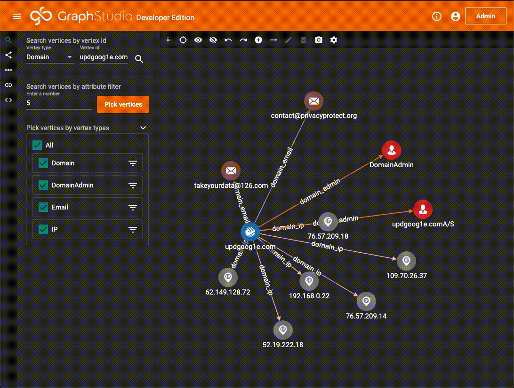
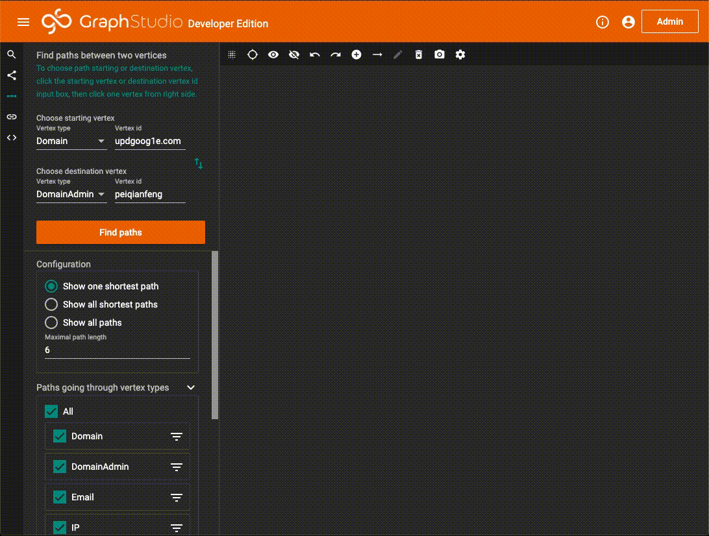
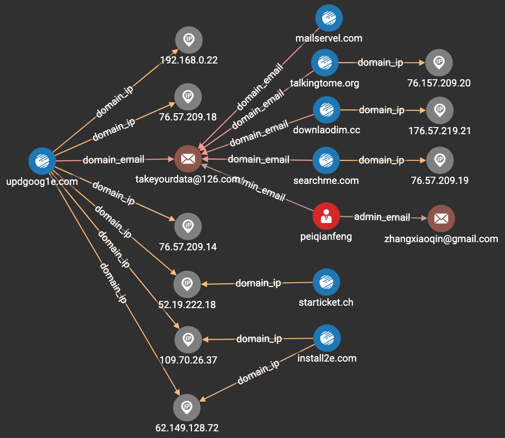

# 交互式分析

TigerGraph 在 GraphStudio 中提供了一个非常不错的交互式分析工具，点击侧边栏的 **Explore Graph**，即开展开交互式分析。

回到这个赛题，要求从域名 `updgoog1e.com` 开始溯源，挖掘与该域名背后的团体相关的其他线索。

### 搜索一个节点

在 Explore Graph 页面的左侧工具栏上，选择 **Search Vertices**，选择 Vertex Type 为 `Domain`，Vertex id 中填写需要搜索的节点，`updgoog1e.com`

在节点上双击，即可展开与该节点有关联的其他节点。如上图所示，可以找到 `updgoog1e.com` 的一步邻居有 2 个 `Email`，6 个 `IP`，2 个 `DomainAdmin`。

顺着一步邻居，继续往下调查，配合顶部工具栏，可以隐藏不关心的节点，当遇到一个超级节点的时候 \(有大量的邻居\)，可以回退到上一个状态。

### 根据需求向外展开

有时我们希望能够自己的需求做节点展开，比如从 `updgoog1e.com` 出发，寻找与该 Domain 相关的 DomainAdmin 和 Email，再从结果中继续往外展开一步，寻找新的 Domain, DomainAdmin 和 Email。在 Explore Graph 页面的左侧工具栏上，选择 **Expand from vertices**。

### 寻找 2 点之间的路径

有时我们可能会有这样的需求，希望知道 2 个节点之间是否存在一条路径，此时可以使用路径寻找功能。在 Explore Graph 页面的左侧工具栏上，选择 **Find paths**。

### 结果

通过几轮交互式分析，根据经验排除一些无价值的线索，譬如关联的域名经过了一个共享主机\(一个IP下绑定很多域名\)，以及一些 "DomainAdmin" 这种明显不是人名的节点。在很短的时间内，可以找到与 `updgoog1e.com` 最相关的 18 条线索，即本赛题的正确答案。

