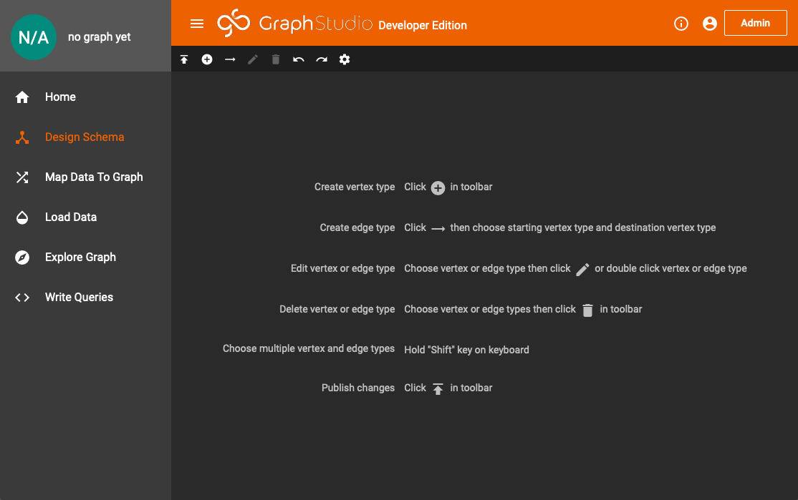
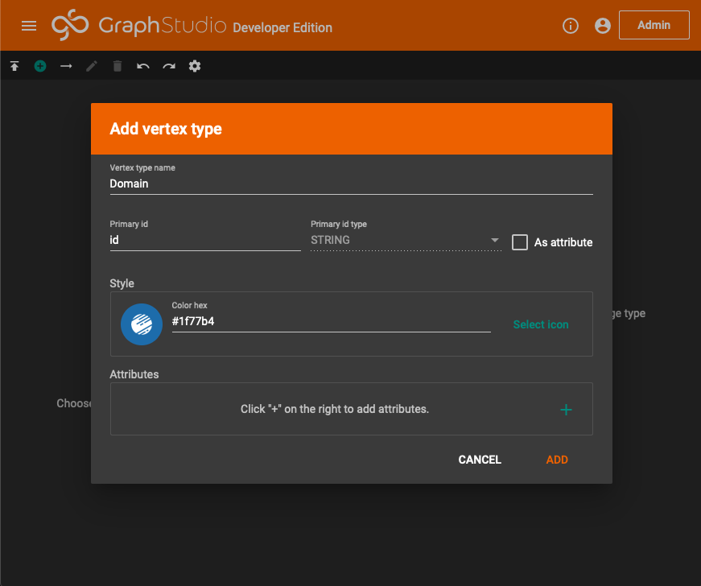
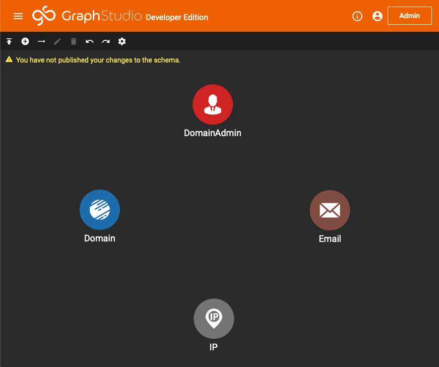
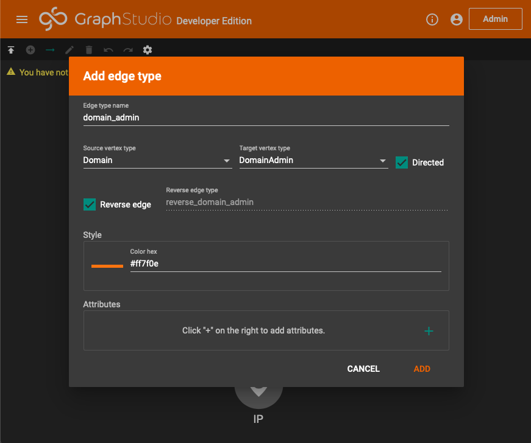
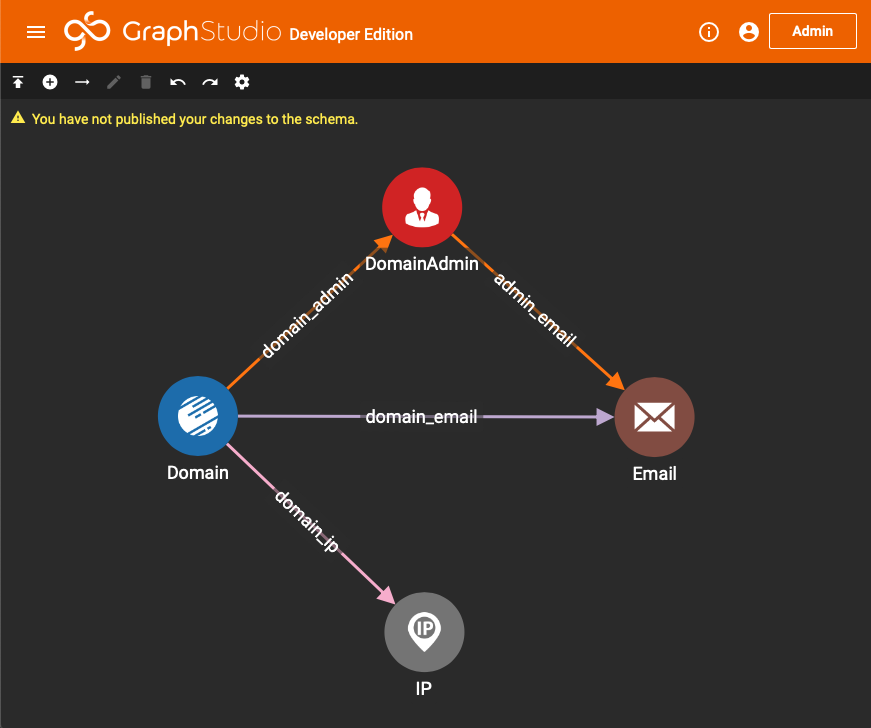
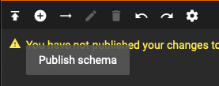

# 创建 Schema

在这个案例中我们将通过 Graph Studio 来完成从 schema 创建、数据导入、查询分析等所有流程。

在使用图数据库进行图分析之前，我们需要创建好 Graph Schema，即定义好在我们需要解决的问题中，哪些信息作为图上的点 \(Vertex\)，哪些信息作为图上的边 \(Edge\)。不同的 Schema 适合解决不同的需求，这点在之后的两个案例中，会有更深的体会。

打开浏览器，访问 TigerGraph 服务器的 14240 端口，选择 Design Schema 页面

## 定义 Vertex

当前的案例比较简单，我们把四类线索对应成图中的四类节点

| 线索 | 节点类型 |
| :--- | :--- |
| 域名 | Domain |
| IP | IP |
| 管理员 | DomainAdmin |
| 邮箱 | Email |

点击 + 键，添加节点:

在创建节点页面中，需要输入节点类型，给该类型节点选择一个方便可视化的颜色和图标。有需要的话，可以给该类型节点配置属性，譬如给 `账号` 节点配置姓名、性别、年龄等属性。在当前这个案例中，我们不需要配置节点属性。


从概念上理解，管理员姓名、邮箱等信息，可以作为域名的属性，但在此案例中，我们的目标是为了做溯源，因此把管理员姓名、邮箱作为节点看待。当然这不是一个黄金标准，可以思考一下什么情况下，应该把一类信息当成其他类信息的属性，还是单独抽象成一类节点。后面几个案例中，我们会接触到其他的设计方式。


重复刚刚的过程，将其他几类节点也加进来:

## 定义 Edge

点击工具栏中 + 号右边的 ---&gt;，启动边创建工具。点亮之后，按顺序点击需要创建关系的两类节点

输入边的类型之后，需要做个选择，即该类型的边是**有向 \(Directed\)** 的还是**无向 \(Undirected\)** 的。

如果是**无向**的，在做图遍历的时候，你可以从 Domain 走向 DomainAdmin，也可以从 DomainAdmin 走向 Domain。如果是有向的，如 Domain -&gt; DomainAdmin，则你只能从 Domain 走向 DomainAdmin，反过来则不行。

若同时勾选了 Directed 与 Reverse edge，则系统会自动创建一条与 `reverse_` 开头的反向边。在某些场景下，比如微博中的关注与被关注，或者银行转账场景，边是有方向的。


实际上，从数据库底层原理来看，无向边等价于同时创建了平行的，方向相反的 2 条边，并自动同步了这 2 条边的边属性。因此无向边需要的存储空间要比单向边来的大。


在我们这个案例中，我希望能不同类型线索之间能够互相遍历，并且能够手动控制每一步遍历的方向，因此对于每种类型的边，都选择 Directed + Reverse edge

这里创建了 4 条有向边 + 4 条反向边，一共 8 种类型，分别为:

* `domain_admin`  `reverse_domain_admin`
* `domain_email`  `reverse_domain_email`
* `admin_email`  `reverse_admin_email`
* `domain_ip`  `reverse_domain_ip`

Schema 设计好之后，需要点击工具栏最左边的按钮，提交变更

